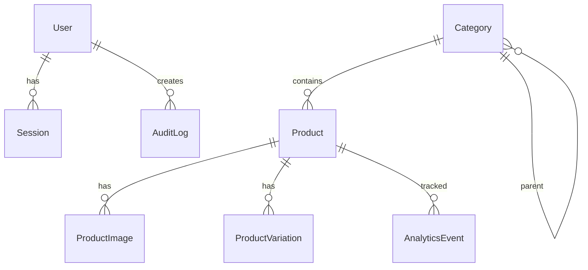

# Backend Implementation Plan - Equipement Ouarzazate

**Project**: Equipement Ouarzazate E-Commerce Platform  
**Version**: 1.0  
**Last Updated**: January 13, 2026  
**Timeline**: 6-8 weeks for full implementation  
**Status**: Planning Phase

---

## 📋 Table of Contents

1. [Executive Summary](#executive-summary)
2. [Technical Stack Decisions](#technical-stack-decisions)
3. [Database Architecture](#database-architecture)
4. [Authentication & Authorization](#authentication--authorization)
5. [API Design](#api-design)
6. [Feature Implementation Roadmap](#feature-implementation-roadmap)
7. [Infrastructure & DevOps](#infrastructure--devops)
8. [Security & Compliance](#security--compliance)
9. [Testing Strategy](#testing-strategy)
10. [Cost Analysis](#cost-analysis)
11. [Migration & Deployment](#migration--deployment)

---

## 📊 Executive Summary

### Project Scope

Building a production-ready backend for an e-commerce platform specializing in construction materials. The backend will support product management, customer communication, analytics, and admin operations.

### Key Objectives

- ✅ Enable admin users to manage products and categories
- ✅ Handle customer inquiries via contact form and newsletter
- ✅ Track product analytics and user behavior
- ✅ Provide secure, role-based admin access
- ✅ Support scalability for future growth (1000+ products, 50k+ monthly visitors)

### Current Status

- **Frontend**: ✅ Complete (Next.js 14, TypeScript, CSS Modules, Dark Mode)
- **Backend**: ❌ Not implemented
- **Integration**: ⏳ Pending backend development

### Success Metrics

- Admin can add/edit/delete products in <5 seconds
- Contact form response time <500ms
- Support 1000+ concurrent users
- 99.9% uptime SLA
- Page load time <2 seconds (including product images)

---

## 🛠️ Technical Stack Decisions

### Core Technologies

| Category | Technology | Rationale |
|----------|-----------|-----------|
| **Runtime** | Node.js 20+ | LTS version, excellent ecosystem |
| **Framework** | Next.js 14 (App Router) | Already in use for frontend, API routes included |
| **Language** | TypeScript 5+ | Type safety, better DX, prevents runtime errors |
| **Database** | PostgreSQL 15+ | Relational data (products ↔ categories), ACID compliance |
| **ORM** | Prisma 5+ | Type-safe queries, great migrations, Prisma Studio for debugging |
| **Authentication** | Lucia v3 | Modern, session-based, full control, self-hosted |
| **Image Storage** | Vercel Blob Storage | Seamless Next.js integration, generous free tier, global CDN |
| **Email Service** | Resend | Developer-friendly, React Email templates, 3k emails/month free |
| **Analytics** | PostHog (self-hosted or cloud) + Custom DB events | Product analytics, session replay, feature flags |
| **Search** | PostgreSQL Full-Text (initial), Meilisearch (later) | Start simple, upgrade when needed |

### Key Technology Rationale

#### **Why PostgreSQL over MongoDB?**
- **Relationships**: Products, categories, variations have clear relational structure
- **Data integrity**: ACID transactions prevent corruption
- **Querying**: Complex joins, filtering, sorting needed for catalog
- **Mature**: Battle-tested, excellent tooling ecosystem

#### **Why Prisma over Raw SQL/Drizzle?**
- **Type safety**: Auto-generated types from schema
- **Migrations**: Version-controlled schema changes
- **Developer Experience**: Prisma Studio for visual debugging
- **Community**: Large ecosystem, extensive documentation

#### **Why Lucia over NextAuth.js?**
- **Modern**: NextAuth.js is in maintenance mode, Lucia is actively developed
- **Flexibility**: Full control over session storage and validation
- **Simplicity**: No magic, clear code flow
- **TypeScript**: First-class TS support, better type inference

#### **Why Vercel Blob over AWS S3?**
- **Integration**: Native Next.js/Vercel integration, zero config
- **Pricing**: 500GB free bandwidth/month (sufficient for Year 1)
- **CDN**: Automatic global distribution via Vercel Edge Network
- **DX**: Simple API, upload in 3 lines of code
- **Migration**: Easy to migrate to Cloudflare R2 if costs grow

#### **Why Resend over SendGrid/Mailgun?**
- **Developer-friendly**: React Email templates (write emails in JSX)
- **Deliverability**: Excellent inbox placement rates
- **Pricing**: 3,000 emails/month free (enough for newsletters)
- **DX**: Simple API, beautiful dashboard

---

## 🗄️ Database Architecture

### Database Choice: Vercel Postgres

- **Hosting**: Vercel Postgres (built on Neon serverless Postgres)
- **Free Tier**: 256MB storage, 60 compute hours/month
- **Paid Tier**: $20/month for 512MB, upgradable to 2GB+
- **Features**: Connection pooling, automatic backups, point-in-time recovery

### Schema Design

#### **Core Entities**

```prisma
// Simplified schema overview - full schema in architecture.md

model User {
  id            String   @id @default(cuid())
  email         String   @unique
  username      String   @unique
  passwordHash  String
  role          UserRole @default(ADMIN)
  createdAt     DateTime @default(now())
  sessions      Session[]
  auditLogs     AuditLog[]
}

model Category {
  id          String    @id @default(cuid())
  slug        String    @unique
  name        String
  description String?
  parentId    String?
  parent      Category? @relation("CategoryTree", fields: [parentId], references: [id])
  children    Category[] @relation("CategoryTree")
  products    Product[]
  imageUrl    String?
  icon        String?
  order       Int       @default(0)
  isActive    Boolean   @default(true)
  createdAt   DateTime  @default(now())
  updatedAt   DateTime  @updatedAt
}

model Product {
  id              String            @id @default(cuid())
  slug            String            @unique
  name            String
  description     String
  categoryId      String
  category        Category          @relation(fields: [categoryId], references: [id])
  images          ProductImage[]
  variations      ProductVariation[]
  basePrice       Decimal?
  status          ProductStatus     @default(DRAFT)
  isFeatured      Boolean           @default(false)
  isNew           Boolean           @default(false)
  seoTitle        String?
  seoDescription  String?
  viewCount       Int               @default(0)
  createdAt       DateTime          @default(now())
  updatedAt       DateTime          @updatedAt
}

model ProductImage {
  id          String   @id @default(cuid())
  productId   String
  product     Product  @relation(fields: [productId], references: [id], onDelete: Cascade)
  url         String
  altText     String?
  order       Int      @default(0)
  isPrimary   Boolean  @default(false)
  createdAt   DateTime @default(now())
}

model ProductVariation {
  id          String   @id @default(cuid())
  productId   String
  product     Product  @relation(fields: [productId], references: [id], onDelete: Cascade)
  name        String   // e.g., "Taille", "Couleur"
  value       String   // e.g., "60x60cm", "Blanc"
  priceModifier Decimal @default(0)
  stock       Int      @default(0)
  sku         String?  @unique
  isActive    Boolean  @default(true)
  createdAt   DateTime @default(now())
}

model ContactMessage {
  id          String        @id @default(cuid())
  name        String
  email       String
  phone       String?
  subject     String?
  message     String
  status      MessageStatus @default(NEW)
  notes       String?
  createdAt   DateTime      @default(now())
  updatedAt   DateTime      @updatedAt
}

model NewsletterSubscriber {
  id              String   @id @default(cuid())
  email           String   @unique
  isSubscribed    Boolean  @default(true)
  subscribedAt    DateTime @default(now())
  unsubscribedAt  DateTime?
  source          String?  // e.g., "homepage", "product_page"
}

model AnalyticsEvent {
  id          String   @id @default(cuid())
  eventType   String   // "product_view", "whatsapp_click", "search"
  productId   String?
  categoryId  String?
  metadata    Json?    // Additional event data
  sessionId   String?
  userAgent   String?
  ipAddress   String?
  createdAt   DateTime @default(now())
}

model AuditLog {
  id          String   @id @default(cuid())
  userId      String
  user        User     @relation(fields: [userId], references: [id])
  action      String   // "create_product", "delete_category"
  entityType  String   // "Product", "Category"
  entityId    String?
  changes     Json?    // Before/after state
  ipAddress   String?
  userAgent   String?
  createdAt   DateTime @default(now())
}

enum UserRole {
  SUPER_ADMIN
  ADMIN
  VIEWER
}

enum ProductStatus {
  DRAFT
  ACTIVE
  INACTIVE
  ARCHIVED
}

enum MessageStatus {
  NEW
  READ
  REPLIED
  ARCHIVED
}
```

### Database Indexing Strategy

**Critical Indexes** (for performance):
```sql
-- Product queries (most frequent)
CREATE INDEX idx_products_category ON Product(categoryId);
CREATE INDEX idx_products_status ON Product(status);
CREATE INDEX idx_products_featured ON Product(isFeatured);
CREATE INDEX idx_products_slug ON Product(slug);

-- Search performance
CREATE INDEX idx_products_name_gin ON Product USING gin(to_tsvector('french', name));
CREATE INDEX idx_products_description_gin ON Product USING gin(to_tsvector('french', description));

-- Analytics queries
CREATE INDEX idx_analytics_product ON AnalyticsEvent(productId, createdAt);
CREATE INDEX idx_analytics_type ON AnalyticsEvent(eventType, createdAt);

-- Admin queries
CREATE INDEX idx_messages_status ON ContactMessage(status, createdAt);
CREATE INDEX idx_audit_logs_user ON AuditLog(userId, createdAt);
```

### Data Relationships Overview



### Database Migration Strategy

1. **Development**: Prisma migrate dev (interactive)
2. **Production**: Prisma migrate deploy (non-interactive, safe)
3. **Rollback**: Git-versioned migrations, revert via `prisma migrate resolve`
4. **Backup**: Daily automated backups via Vercel Postgres
5. **Seeding**: Prisma seed script for initial categories and sample products

---

## 🔐 Authentication & Authorization

### Authentication System: Lucia v3

#### **Session Management**

- **Session Storage**: PostgreSQL (Session table)
- **Session Duration**: 30 days (extendable with "Remember Me")
- **Session Validation**: On every authenticated API request
- **Session Cleanup**: Cron job to delete expired sessions (weekly)

#### **Password Security**

- **Hashing Algorithm**: Argon2id (recommended by OWASP)
- **Cost Factor**: time=2, memory=19MB, parallelism=1
- **Salt**: Automatic per-password salt via Argon2
- **Rehashing**: Check hash version, rehash on login if outdated

#### **Login Flow**

```typescript
// Simplified authentication flow
async function login(username: string, password: string, rememberMe: boolean) {
  // 1. Rate limit check (max 5 attempts per IP per 15 minutes)
  await checkRateLimit(request.ip);
  
  // 2. Find user
  const user = await prisma.user.findUnique({ where: { username } });
  if (!user) throw new Error("Invalid credentials");
  
  // 3. Verify password
  const validPassword = await argon2.verify(user.passwordHash, password);
  if (!validPassword) {
    await logFailedAttempt(request.ip);
    throw new Error("Invalid credentials");
  }
  
  // 4. Create session
  const session = await lucia.createSession(user.id, {
    expiresIn: rememberMe ? "30d" : "1d"
  });
  
  // 5. Set session cookie
  cookies.set("session", session.id, {
    httpOnly: true,
    secure: true,
    sameSite: "lax",
    maxAge: session.expiresAt
  });
  
  // 6. Log audit trail
  await logAuditEvent("user_login", user.id);
  
  return { user, session };
}
```

### Authorization System: Role-Based Access Control (RBAC)

#### **User Roles**

| Role | Permissions | Use Case |
|------|-------------|----------|
| **SUPER_ADMIN** | Full access (products, categories, users, settings, delete operations) | Owner |
| **ADMIN** | Manage products, categories, view messages, limited settings | Manager/Staff |
| **VIEWER** | Read-only access to dashboard and reports | Accountant/Analyst |

#### **Permission Middleware**

```typescript
// Route protection middleware
async function requireAuth(request: Request) {
  const sessionId = cookies.get("session");
  if (!sessionId) throw new UnauthorizedError();
  
  const { user, session } = await lucia.validateSession(sessionId);
  if (!session) throw new UnauthorizedError();
  
  return { user, session };
}

async function requireRole(allowedRoles: UserRole[]) {
  const { user } = await requireAuth(request);
  if (!allowedRoles.includes(user.role)) {
    throw new ForbiddenError();
  }
  return user;
}

// Usage in API routes
// Only SUPER_ADMIN can delete products
export async function DELETE(request: Request) {
  await requireRole(["SUPER_ADMIN"]);
  // ... delete logic
}
```

#### **Granular Permissions (Future Enhancement)**

For finer control, implement permission-based system:

```typescript
enum Permission {
  PRODUCT_CREATE,
  PRODUCT_EDIT,
  PRODUCT_DELETE,
  PRODUCT_VIEW,
  CATEGORY_MANAGE,
  USER_MANAGE,
  SETTINGS_EDIT,
  ANALYTICS_VIEW,
}

const rolePermissions: Record<UserRole, Permission[]> = {
  SUPER_ADMIN: [...all permissions],
  ADMIN: [PRODUCT_CREATE, PRODUCT_EDIT, PRODUCT_VIEW, CATEGORY_MANAGE, ANALYTICS_VIEW],
  VIEWER: [PRODUCT_VIEW, ANALYTICS_VIEW],
};
```

---

## 🌐 API Design

### API Architecture: Next.js App Router API Routes

#### **API Structure**

```
/src/app/api/
├── auth/
│   ├── login/route.ts          # POST /api/auth/login
│   ├── logout/route.ts         # POST /api/auth/logout
│   └── session/route.ts        # GET /api/auth/session
├── admin/
│   ├── products/
│   │   ├── route.ts            # GET /api/admin/products (list), POST (create)
│   │   ├── [id]/route.ts       # GET, PATCH, DELETE /api/admin/products/:id
│   │   ├── [id]/images/route.ts # POST /api/admin/products/:id/images
│   │   └── bulk/route.ts       # POST /api/admin/products/bulk (import)
│   ├── categories/
│   │   ├── route.ts            # GET, POST /api/admin/categories
│   │   └── [id]/route.ts       # GET, PATCH, DELETE /api/admin/categories/:id
│   ├── messages/
│   │   ├── route.ts            # GET /api/admin/messages
│   │   └── [id]/route.ts       # PATCH /api/admin/messages/:id (mark read)
│   ├── newsletter/
│   │   ├── subscribers/route.ts # GET /api/admin/newsletter/subscribers
│   │   └── campaign/route.ts   # POST /api/admin/newsletter/campaign
│   ├── analytics/route.ts      # GET /api/admin/analytics
│   └── settings/route.ts       # GET, PATCH /api/admin/settings
├── public/
│   ├── products/
│   │   ├── route.ts            # GET /api/public/products (list with filters)
│   │   ├── [slug]/route.ts     # GET /api/public/products/:slug
│   │   └── search/route.ts     # GET /api/public/products/search?q=
│   ├── categories/route.ts     # GET /api/public/categories
│   ├── contact/route.ts        # POST /api/public/contact
│   └── newsletter/route.ts     # POST /api/public/newsletter/subscribe
├── analytics/
│   └── track/route.ts          # POST /api/analytics/track
└── upload/
    └── image/route.ts          # POST /api/upload/image
```

#### **API Response Format (Standardized)**

```typescript
// Success response
{
  "success": true,
  "data": { /* actual data */ },
  "meta": {
    "timestamp": "2026-01-13T23:00:00Z",
    "requestId": "req_abc123"
  }
}

// Error response
{
  "success": false,
  "error": {
    "code": "VALIDATION_ERROR",
    "message": "Invalid product data",
    "details": {
      "name": "Name is required",
      "price": "Price must be positive"
    }
  },
  "meta": {
    "timestamp": "2026-01-13T23:00:00Z",
    "requestId": "req_abc123"
  }
}

// Paginated response
{
  "success": true,
  "data": [ /* items */ ],
  "pagination": {
    "page": 1,
    "pageSize": 20,
    "total": 156,
    "totalPages": 8
  }
}
```

#### **Error Handling Strategy**

```typescript
// Custom error classes
class AppError extends Error {
  constructor(
    public statusCode: number,
    public code: string,
    message: string,
    public details?: unknown
  ) {
    super(message);
  }
}

class ValidationError extends AppError {
  constructor(message: string, details?: unknown) {
    super(400, "VALIDATION_ERROR", message, details);
  }
}

class UnauthorizedError extends AppError {
  constructor(message = "Unauthorized") {
    super(401, "UNAUTHORIZED", message);
  }
}

// Global error handler
export async function errorHandler(error: unknown) {
  if (error instanceof AppError) {
    return Response.json(
      {
        success: false,
        error: {
          code: error.code,
          message: error.message,
          details: error.details,
        },
      },
      { status: error.statusCode }
    );
  }
  
  // Unknown errors - log but don't expose details
  console.error("Unexpected error:", error);
  await logErrorToSentry(error);
  
  return Response.json(
    {
      success: false,
      error: {
        code: "INTERNAL_SERVER_ERROR",
        message: "An unexpected error occurred",
      },
    },
    { status: 500 }
  );
}
```

#### **Request Validation (Zod)**

```typescript
import { z } from "zod";

const createProductSchema = z.object({
  name: z.string().min(3).max(200),
  description: z.string().min(10),
  categoryId: z.string().cuid(),
  basePrice: z.number().positive().optional(),
  status: z.enum(["DRAFT", "ACTIVE", "INACTIVE"]).default("DRAFT"),
  isFeatured: z.boolean().default(false),
  images: z.array(z.object({
    url: z.string().url(),
    altText: z.string().optional(),
  })).min(1).max(5),
});

// Usage
export async function POST(request: Request) {
  const body = await request.json();
  const validatedData = createProductSchema.parse(body); // Throws if invalid
  
  // ... create product with validatedData
}
```

---

## 🚀 Feature Implementation Roadmap

### **Phase 1: Foundation (Week 1-2)**

**Week 1: Database & Auth**
- [x] Set up Vercel Postgres database
- [x] Define Prisma schema (all models)
- [x] Run initial migrations
- [x] Implement Lucia authentication
- [x] Create login/logout API routes
- [x] Build session validation middleware
- [x] Create super admin seed script

**Week 2: Core Admin APIs**
- [x] Product CRUD API endpoints
- [x] Category CRUD API endpoints
- [x] Image upload to Vercel Blob
- [x] Input validation with Zod
- [x] Error handling middleware
- [x] Basic unit tests for APIs

**Deliverable**: Admin can login and manage products via API (test with Postman)

---

### **Phase 2: Admin UI Integration (Week 3)**

**Admin Dashboard Pages**
- [x] `/admin/login` - Login page
- [x] `/admin/dashboard` - Overview with stats
- [x] `/admin/products` - Product list with pagination, search, filters
- [x] `/admin/products/new` - Create product form
- [x] `/admin/products/[id]/edit` - Edit product form
- [x] `/admin/categories` - Category management
- [x] `/admin/messages` - Contact messages inbox
- [x] `/admin/newsletter` - Subscriber list

**UI Components**
- [x] Admin layout with sidebar navigation
- [x] Data table component (sortable, filterable)
- [x] Form components (text input, textarea, select, image upload)
- [x] Rich text editor (for product descriptions)
- [x] Image upload with preview and drag-n-drop
- [x] Toast notifications for success/error feedback

**Deliverable**: Fully functional admin panel for product management

---

### **Phase 3: Customer Communication (Week 4)**

**Contact Form**
- [x] `/api/public/contact` - Handle form submissions
- [x] Email notification to admin via Resend
- [x] Auto-response to customer (optional)
- [x] Spam protection (rate limiting, honeypot)
- [x] Admin UI to view/respond to messages

**Newsletter**
- [x] `/api/public/newsletter/subscribe` - Subscription endpoint
- [x] Email confirmation (double opt-in)
- [x] Welcome email automation
- [x] Unsubscribe functionality
- [x] Admin UI for subscriber list

**Email Templates**
- [x] Welcome email template (React Email)
- [x] Contact form notification template
- [x] Newsletter template (basic)

**Deliverable**: Contact form and newsletter operational

---

### **Phase 4: Analytics & Search (Week 5)**

**Analytics**
- [x] Event tracking system (product views, WhatsApp clicks)
- [x] Analytics API endpoints
- [x] Dashboard metrics (popular products, traffic sources)
- [x] PostHog integration (session replay, funnels)

**Search**
- [x] PostgreSQL full-text search
- [x] Search API endpoint with ranking
- [x] Search autocomplete
- [x] Search analytics (track search queries)

**Frontend Integration**
- [x] Update product pages to track views
- [x] Add analytics events to WhatsApp CTAs
- [x] Implement search bar in header
- [x] Search results page

**Deliverable**: Analytics dashboard and functional search

---

### **Phase 5: Security & Polish (Week 6)**

**Security Hardening**
- [x] Rate limiting on all public APIs
- [x] CSRF protection
- [x] SQL injection prevention audit
- [x] XSS prevention audit
- [x] Security headers (CSP, HSTS)
- [x] Environment variable validation

**Role-Based Access**
- [x] Implement RBAC middleware
- [x] Admin user management page
- [x] Permission checks on all admin routes
- [x] Audit logging for admin actions

**Performance Optimization**
- [x] Database query optimization (use indexes)
- [x] API response caching (for product lists)
- [x] Image optimization pipeline
- [x] Lazy loading for admin tables

**Testing**
- [x] API integration tests (80% coverage)
- [x] E2E tests for critical flows (login, create product)
- [x] Load testing (simulate 1000 concurrent users)

**Deliverable**: Production-ready, secure backend

---

### **Phase 6: Advanced Features (Week 7-8)** *(Optional for MVP)*

**Email Campaigns**
- [ ] Campaign creation UI
- [ ] Email template builder
- [ ] Subscriber segmentation
- [ ] Schedule campaigns
- [ ] Track open/click rates

**Advanced Search**
- [ ] Migrate to Meilisearch for faster search
- [ ] Multi-language search (French + Arabic)
- [ ] Fuzzy matching and typo tolerance
- [ ] Synonym support

**Bulk Operations**
- [ ] CSV/Excel import for products
- [ ] Bulk edit (update multiple products at once)
- [ ] Export products to CSV

**Advanced Analytics**
- [ ] Conversion funnel visualization
- [ ] User segmentation
- [ ] A/B testing framework
- [ ] Custom reports

**Deliverable**: Enterprise-grade feature set

---

## ☁️ Infrastructure & DevOps

### Hosting Architecture

```
┌─────────────────────────────────────────────────────┐
│                   Vercel Platform                    │
├─────────────────────────────────────────────────────┤
│  Next.js App (Frontend + API Routes)                │
│  - Automatic HTTPS                                   │
│  - Global Edge Network                               │
│  - Serverless Functions (API routes)                 │
└─────────────────────────────────────────────────────┘
                          │
        ┌─────────────────┼─────────────────┐
        │                 │                 │
        ▼                 ▼                 ▼
┌──────────────┐  ┌──────────────┐  ┌──────────────┐
│   Vercel     │  │   Vercel     │  │   Resend     │
│   Postgres   │  │    Blob      │  │  (Emails)    │
│  (Database)  │  │  (Images)    │  │              │
└──────────────┘  └──────────────┘  └──────────────┘
        │                 │                 │
        └─────────────────┴─────────────────┘
                          │
                          ▼
                  ┌──────────────┐
                  │   PostHog    │
                  │ (Analytics)  │
                  └──────────────┘
```

### Environment Configuration

**Environment Variables** (`.env.local` for dev, Vercel dashboard for production):

```bash
# Database
DATABASE_URL="postgres://..."
DIRECT_URL="postgres://..." # For Prisma migrations

# Authentication
SESSION_SECRET="random-32-char-string" # Generated securely

# Image Storage
BLOB_READ_WRITE_TOKEN="vercel_blob_..." # From Vercel dashboard

# Email
RESEND_API_KEY="re_..." # From Resend dashboard
ADMIN_EMAIL="equipementouarzazate@gmail.com"

# Analytics
NEXT_PUBLIC_POSTHOG_KEY="phc_..."
NEXT_PUBLIC_POSTHOG_HOST="https://app.posthog.com"

# App Config
NEXT_PUBLIC_APP_URL="https://equipement-ouarzazate.ma"
NODE_ENV="production"
```

### Deployment Strategy

**Git Workflow**:
```
main (production) ← merge from staging
  │
  └── staging (pre-production) ← merge from develop
        │
        └── develop (active development) ← feature branches
```

**Deployment Process**:
1. **Development**: Push to `develop` → Auto-deploy to dev environment
2. **Staging**: Merge to `staging` → Auto-deploy to staging environment → QA testing
3. **Production**: Merge to `main` → Auto-deploy to production → Monitor logs

**Rollback Strategy**:
- Vercel allows instant rollback to previous deployment (one click)
- Database migrations: Manual rollback via Prisma if needed
- Feature flags: Disable features via settings without code deploy

### Monitoring & Alerting

**Error Tracking: Sentry**
- Automatic error capture on frontend and backend
- Source maps for stack traces
- Alert via email/Slack for critical errors

**Uptime Monitoring: BetterStack (or UptimeRobot)**
- Ping `/api/health` every 1 minute
- Alert if down for >2 minutes
- SMS + email notifications

**Performance Monitoring: Vercel Analytics**
- Core Web Vitals tracking
- API response time monitoring
- Serverless function execution time

**Logging: Vercel Logs + Logtail**
- Structured logging with Winston/Pino
- Log levels: DEBUG, INFO, WARN, ERROR
- Log retention: 30 days
- Search and filter logs by level, timestamp, user

### Backup Strategy

**Database Backups**:
- **Automatic**: Vercel Postgres daily backups (retained 7 days)
- **Manual**: Weekly manual backup export to S3 (retained 90 days)
- **Point-in-Time Recovery**: Available with Vercel Pro plan

**Image Backups**:
- **Vercel Blob**: Built-in redundancy, no manual backups needed
- **Versioning**: Enable versioning to prevent accidental deletes

**Code Backups**:
- **Git Repository**: GitHub private repo (main source of truth)
- **Protected Branches**: `main` and `staging` require pull request reviews

### Disaster Recovery Plan

**Scenario 1: Database Corruption**
- Restore from latest automated backup (RPO: 24 hours)
- Estimated recovery time: 30 minutes

**Scenario 2: Complete Vercel Outage**
- Migrate to alternative host (Netlify, Railway)
- Update DNS records
- Estimated recovery time: 2-4 hours

**Scenario 3: Data Breach**
- Immediately revoke all API keys and session tokens
- Notify users via email within 72 hours (GDPR requirement)
- Full security audit and patch vulnerabilities

---

## 🔒 Security & Compliance

### Security Checklist

**Authentication & Authorization**
- ✅ Passwords hashed with Argon2id
- ✅ Session tokens stored securely (httpOnly cookies)
- ✅ CSRF protection on all state-changing endpoints
- ✅ Rate limiting (5 login attempts per 15 minutes)
- ✅ 2FA support (future enhancement)

**Data Validation**
- ✅ Input validation with Zod on all API endpoints
- ✅ Sanitize user input to prevent XSS
- ✅ Parameterized queries via Prisma (prevent SQL injection)
- ✅ File upload type validation (images only)

**Network Security**
- ✅ HTTPS enforced (automatic via Vercel)
- ✅ Security headers (CSP, HSTS, X-Frame-Options)
- ✅ CORS configured (allow only trusted origins)
- ✅ API rate limiting (cloudflare or vercel edge)

**Data Protection**
- ✅ Environment variables for secrets (not in code)
- ✅ Database encryption at rest (Vercel Postgres default)
- ✅ Audit logging for sensitive operations
- ✅ Regular dependency updates (Dependabot)

### GDPR Compliance

**User Rights**
- **Right to Access**: User can request their data (contact via email)
- **Right to Deletion**: User can request data deletion (admin panel feature)
- **Right to Portability**: Export user data in JSON format

**Data Collection Transparency**
- Privacy policy page clearly states:
  - What data is collected (name, email, phone, messages)
  - How it's used (respond to inquiries, send newsletters)
  - How long it's stored (messages: 2 years, newsletters: until unsubscribe)
  - Third parties with access (Resend for emails, PostHog for analytics)

**Cookie Consent** (if using non-essential cookies)
- Cookie banner with opt-in (not pre-checked)
- Separate consent for analytics cookies
- Opt-out link in footer

**Data Retention Policy**
- Contact messages: Archived after 2 years, deleted after 3 years
- Newsletter subscribers: Deleted 30 days after unsubscribe
- Analytics events: Aggregated after 90 days, raw data deleted

---

## 🧪 Testing Strategy

### Testing Pyramid

```
        ┌──────────────┐
        │     E2E      │  ← 10% (Critical user flows)
        │    Tests     │
        ├──────────────┤
        │ Integration  │  ← 30% (API endpoints, DB interactions)
        │    Tests     │
        ├──────────────┤
        │     Unit     │  ← 60% (Business logic, utilities)
        │    Tests     │
        └──────────────┘
```

### Testing Tools

- **Unit Tests**: Vitest (fast, ESM-native)
- **Integration Tests**: Vitest + MockPrisma / Test Database
- **E2E Tests**: Playwright (cross-browser, visual regression)
- **Load Testing**: k6 or Artillery (simulate 1000+ concurrent users)

### Test Coverage Goals

- **Business Logic**: 90% coverage
- **API Routes**: 80% coverage
- **React Components**: 70% coverage (critical paths)
- **Overall**: 75% minimum

### Example Test Cases

**Unit Test: Password Hashing**
```typescript
describe("User Authentication", () => {
  it("should hash password with Argon2id", async () => {
    const password = "SecureP@ssw0rd";
    const hash = await hashPassword(password);
    
    expect(hash).not.toBe(password);
    expect(await verifyPassword(hash, password)).toBe(true);
    expect(await verifyPassword(hash, "wrongpassword")).toBe(false);
  });
});
```

**Integration Test: Product Creation API**
```typescript
describe("POST /api/admin/products", () => {
  it("should create product when authenticated as admin", async () => {
    const session = await createTestSession("admin");
    
    const response = await POST("/api/admin/products", {
      body: {
        name: "Test Product",
        description: "Test description",
        categoryId: "cat_123",
        images: [{ url: "https://...", altText: "Test" }],
      },
      cookies: { session: session.id },
    });
    
    expect(response.status).toBe(201);
    expect(response.data.product.name).toBe("Test Product");
    
    // Verify in database
    const product = await prisma.product.findUnique({
      where: { id: response.data.product.id },
    });
    expect(product).toBeTruthy();
  });
  
  it("should reject when not authenticated", async () => {
    const response = await POST("/api/admin/products", {
      body: { name: "Test" },
    });
    
    expect(response.status).toBe(401);
  });
});
```

**E2E Test: Admin Login Flow**
```typescript
test("admin can login and create product", async ({ page }) => {
  // Navigate to login
  await page.goto("/admin/login");
  
  // Fill credentials
  await page.fill('input[name="username"]', "admin");
  await page.fill('input[name="password"]', "password");
  await page.click('button[type="submit"]');
  
  // Should redirect to dashboard
  await page.waitForURL("/admin/dashboard");
  expect(page.url()).toContain("/admin/dashboard");
  
  // Navigate to products
  await page.click('a[href="/admin/products"]');
  await page.click('button:has-text("Nouveau produit")');
  
  // Fill product form
  await page.fill('input[name="name"]', "E2E Test Product");
  await page.fill('textarea[name="description"]', "Test description");
  await page.selectOption('select[name="categoryId"]', "cat_123");
  await page.click('button:has-text("Créer")');
  
  // Should show success toast
  await expect(page.locator('.toast-success')).toBeVisible();
});
```

---

## 💰 Cost Analysis

### Monthly Cost Breakdown (Year 1)

| Service | Free Tier | Estimated Usage | Cost |
|---------|-----------|-----------------|------|
| **Vercel Hosting** | Hobby plan | Low traffic | **$0** |
| **Vercel Postgres** | 256MB, 60 compute hrs | <1000 products | **$0** |
| **Vercel Blob** | 500GB bandwidth | ~100GB/month | **$0** |
| **Resend** | 3,000 emails/month | ~1,000/month | **$0** |
| **PostHog** | 1M events/month | ~500k events | **$0** |
| **Domain** | N/A | 1 domain | **$1/mo** |
| **Total** | | | **~$1/month** |

### Scaling Costs (Year 2 - High Traffic Scenario)

| Service | Plan | Estimated Usage | Cost |
|---------|------|-----------------|------|
| **Vercel Hosting** | Pro | 100k requests/day | **$20/mo** |
| **Vercel Postgres** | Pro 512MB | 2000 products | **$20/mo** |
| **Vercel Blob** | Pay-as-you-go | 800GB bandwidth | **$15/mo** |
| **Resend** | Starter | 10k emails/month | **$20/mo** |
| **PostHog** | Scale | 2M events/month | **$30/mo** |
| **Sentry** | Team | Error tracking | **$26/mo** |
| **Domain** | N/A | 1 domain | **$1/mo** |
| **Total** | | | **~$132/month** |

### Cost Optimization Tips

1. **Monitor usage monthly** - Set billing alerts at 80% of free tier limits
2. **Lazy load analytics** - Don't track every click, focus on valuable events
3. **Image optimization** - Compress images before upload to reduce storage
4. **Cache aggressively** - Use Vercel Edge caching for product catalog
5. **Archive old data** - Move old messages/analytics to cold storage after 6 months

---

## 🚢 Migration & Deployment

### Initial Deployment Steps

**Step 1: Database Setup**
```bash
# 1. Create Vercel Postgres database via dashboard
# 2. Copy DATABASE_URL to .env.local
# 3. Run migrations
npx prisma migrate deploy

# 4. Seed initial data
npx prisma db seed
```

**Step 2: Environment Variables**
- Set all required env vars in Vercel dashboard
- Use different values for staging vs production

**Step 3: First Deployment**
```bash
# Connect to Vercel
vercel login
vercel link

# Deploy to staging
vercel --env staging

# Test staging thoroughly

# Deploy to production
vercel --prod
```

**Step 4: Post-Deployment**
- Create super admin user (via Prisma Studio or seed script)
- Test login flow
- Upload test product
- Send test email
- Monitor logs for errors

### Data Migration Plan (From Current Static Data)

**Current State**: Products and categories in `/src/data/*.ts` files

**Migration Script**:
```typescript
// scripts/migrate-static-to-db.ts
import { products } from '../src/data/products';
import { categories } from '../src/data/categories';
import { prisma } from '../src/lib/prisma';

async function migrateData() {
  console.log("Migrating categories...");
  for (const category of categories) {
    await prisma.category.create({
      data: {
        id: category.id,
        slug: category.slug,
        name: category.name,
        description: category.description,
        imageUrl: category.image,
        icon: category.icon,
        order: category.order,
      },
    });
  }
  
  console.log("Migrating products...");
  for (const product of products) {
    const createdProduct = await prisma.product.create({
      data: {
        slug: product.slug,
        name: product.name,
        description: product.description,
        categoryId: product.category,
        basePrice: product.price,
        status: "ACTIVE",
        isFeatured: product.featured || false,
        isNew: product.isNew || false,
      },
    });
    
    // Migrate images
    for (const [index, image] of product.images.entries()) {
      await prisma.productImage.create({
        data: {
          productId: createdProduct.id,
          url: image,
          altText: product.name,
          order: index,
          isPrimary: index === 0,
        },
      });
    }
  }
  
  console.log("Migration complete!");
}

migrateData();
```

**Run Migration**:
```bash
npx tsx scripts/migrate-static-to-db.ts
```

### Frontend Integration Changes

**Before (Static Data)**:
```typescript
import { products } from '@/data/products';
const product = products.find(p => p.slug === slug);
```

**After (API)**:
```typescript
const response = await fetch(`/api/public/products/${slug}`);
const { data: product } = await response.json();
```

**Update Required Files**:
- `/src/app/produit/[slug]/page.tsx` - Fetch from API instead of static
- `/src/app/catalogue/[slug]/page.tsx` - Fetch category products from API
- `/src/app/page.tsx` - Fetch featured products from API
- `/src/components/sections/FeaturedProducts` - Use API data

---

## 📚 Additional Resources

### Documentation to Create

1. **API Documentation** - Swagger/OpenAPI spec for all endpoints
2. **Database Schema Diagram** - Visual ERD for developers
3. **Admin User Guide** - Step-by-step guide for non-technical admins
4. **Developer Onboarding** - Setup guide for new developers
5. **Runbook** - Incident response procedures

### External Resources

- [Next.js App Router Docs](https://nextjs.org/docs/app)
- [Prisma Documentation](https://www.prisma.io/docs)
- [Lucia Auth Guide](https://lucia-auth.com/)
- [Vercel Blob Storage Guide](https://vercel.com/docs/storage/vercel-blob)
- [Resend Documentation](https://resend.com/docs)
- [PostHog Documentation](https://posthog.com/docs)

---

## ✅ Pre-Launch Checklist

### Security
- [ ] All API endpoints have authentication/authorization
- [ ] Rate limiting on public endpoints
- [ ] CSRF protection enabled
- [ ] Security headers configured
- [ ] Environment variables validated
- [ ] SQL injection audit passed
- [ ] XSS prevention audit passed

### Performance
- [ ] Database indexes created
- [ ] Image optimization pipeline tested
- [ ] API response times <500ms
- [ ] Lighthouse score >90
- [ ] Load testing passed (1000 concurrent users)

### Compliance
- [ ] Privacy policy published
- [ ] Cookie consent banner (if needed)
- [ ] GDPR data export feature
- [ ] Data retention policy documented

### Monitoring
- [ ] Error tracking (Sentry) configured
- [ ] Uptime monitoring active
- [ ] Log aggregation working
- [ ] Alerting rules set up

### Backup & Recovery
- [ ] Automated database backups enabled
- [ ] Backup restoration tested
- [ ] Disaster recovery plan documented

### Documentation
- [ ] API documentation complete
- [ ] Admin user guide written
- [ ] Developer README updated
- [ ] Architecture.md created

---

## 🎯 Success Criteria

The backend implementation will be considered successful when:

1. ✅ Admin can manage products/categories without technical knowledge
2. ✅ All contact form submissions are delivered via email
3. ✅ Newsletter subscriptions are tracked and exportable
4. ✅ Analytics dashboard shows accurate metrics
5. ✅ Search returns relevant results in <300ms
6. ✅ System handles 1000+ concurrent users without degradation
7. ✅ Zero security vulnerabilities in production
8. ✅ 99.9% uptime over 30 days
9. ✅ All tests passing with >75% coverage
10. ✅ Non-technical admin successfully uses the system

---

**Document Version**: 1.0  
**Next Review**: After Phase 1 completion (Week 2)  
**Owner**: Development Team  
**Stakeholder**: Equipement Ouarzazate

---

**Questions or Clarifications?**  
Contact: [Your Email] or create an issue in the GitHub repository.
