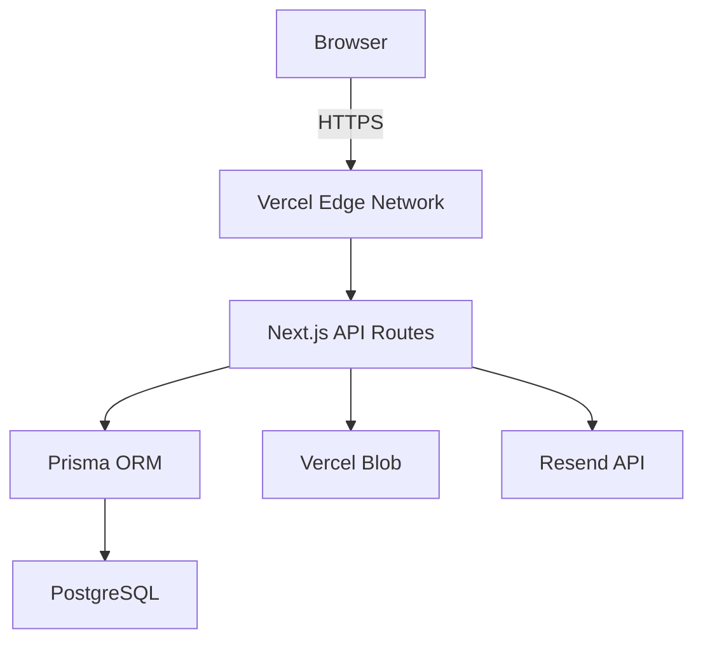
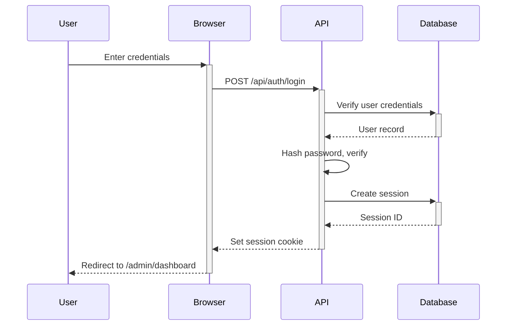

# PROMPT: Generate Architecture.md for Equipement Ouarzazate

**CONTEXT**: You are a world-class Full-Stack Developer and System Architect creating the definitive technical architecture document for the "Equipement Ouarzazate" e-commerce platform. This document will serve as the **SINGLE SOURCE OF TRUTH** for all development decisions.

---

## YOUR ROLE

You are an expert in:
- **Full-Stack Development** (Next.js, TypeScript, PostgreSQL, Prisma)
- **System Architecture** (scalable, maintainable, secure)
- **Best Practices** (SOLID, DRY, security, performance)
- **Documentation** (clear, comprehensive, actionable)

---

## YOUR MISSION

Create a comprehensive `architecture.md` file in the root of the project (`c:\Users\hp\Desktop\equipement-ouarzazate\architecture.md`) that documents:

1. **System Architecture Overview** - High-level architecture diagrams and explanations
2. **Technology Stack** - All technologies used and why
3. **Project Structure** - Complete directory tree with explanations
4. **Database Schema** - Full Prisma schema with relationships documented
5. **API Architecture** - All endpoints, request/response formats, authentication
6. **File Organization** - Where to put new files, naming conventions
7. **Code Standards** - TypeScript patterns, React patterns, CSS patterns
8. **Integration Points** - How frontend connects to backend, third-party services
9. **Security Patterns** - Authentication, authorization, data validation
10. **Development Workflow** - How to add features, test, deploy
11. **Troubleshooting Guide** - Common issues and solutions
12. **Future Considerations** - Scalability, multi-language, e-commerce

---

## CRITICAL REQUIREMENTS

### 1. **SINGLE SOURCE OF TRUTH**
- This document must answer ALL architectural questions
- Developers should NEVER need to guess where to put code
- Every technology choice must be explained with rationale

### 2. **COMPREHENSIVE BUT SCANNABLE**
- Use clear headers, tables, diagrams, code examples
- Include a detailed table of contents with anchor links
- Use mermaid diagrams for visual architecture
- Format code examples with syntax highlighting

### 3. **DECISION DOCUMENTATION**
For every major decision, document:
- **What** was chosen
- **Why** it was chosen over alternatives
- **When** to reconsider (e.g., "when we reach 10k products, consider Meilisearch")

### 4. **RIPPLE EFFECT ANALYSIS**
For common changes, document what else needs updating:
- Example: "When adding a new product field:"
  - [ ] Update Prisma schema
  - [ ] Run migration
  - [ ] Update ProductForm component
  - [ ] Update product validation schema (Zod)
  - [ ] Update TypeScript types (auto-generated from Prisma)
  - [ ] Update API endpoint
  - [ ] Add to product detail page display

### 5. **DEVELOPER ONBOARDING**
Include sections that help new developers (human or AI):
- "How to add a new feature"
- "How to add a new API endpoint"
- "How to add a new admin page"
- "How to modify the database schema"

---

## INSTRUCTIONS

### **Step 1: Read the Backend Implementation Plan**
First, thoroughly read `BACKEND-IMPLEMENTATION-PLAN.md` (in the project root). This contains all technical decisions, timelines, and feature specifications.

### **Step 2: Explore the Current Codebase**
Scan the existing frontend codebase to understand:
- Current directory structure (`/src/app`, `/src/components`, `/src/config`, etc.)
- Existing patterns (CSS Modules, TypeScript, barrel exports)
- Design system (colors, typography, components)
- Configuration files (`tsconfig.json`, `next.config.js`, etc.)

### **Step 3: Create Architecture.md**
Generate a comprehensive architecture document with these sections:

#### **Required Sections (in order):**

1. **Document Header**
   - Project name, version, last updated, purpose

2. **Table of Contents**
   - Detailed TOC with anchor links to all sections

3. **System Overview**
   - High-level description
   - Mermaid diagram of system architecture
   - Tech stack summary table

4. **Technology Stack Deep Dive**
   - For each technology: Name, Version, Purpose, Why chosen, Alternatives considered
   - Frontend, Backend, Database, Infrastructure, DevOps, Testing

5. **Project Structure**
   - Complete directory tree with annotations
   - File naming conventions
   - Where to add new files (decision matrix)

6. **Database Architecture**
   - Full Prisma schema with inline comments
   - ERD diagram (mermaid)
   - Indexing strategy
   - Migration workflow

7. **API Architecture**
   - API structure tree
   - Authentication flow diagram
   - Standard request/response formats
   - Error handling patterns
   - All endpoint specifications (grouped by domain)

8. **Frontend Architecture**
   - Component hierarchy
   - State management approach
   - Routing structure
   - Form handling patterns
   - Image optimization

9. **Authentication & Authorization**
   - How Lucia is implemented
   - Session management
   - Role-based access control
   - Permission checks

10. **Security Patterns**
    - Input validation (Zod schemas)
    - CSRF protection
    - Rate limiting
    - XSS prevention
    - SQL injection prevention

11. **Code Standards & Patterns**
    - TypeScript conventions
    - React component patterns
    - CSS Module patterns
    - Naming conventions
    - Comment standards

12. **Integration Points**
    - Frontend ↔ Backend API
    - Vercel Blob (image uploads)
    - Resend (email)
    - PostHog (analytics)

13. **Developer Workflows**
    - How to add a new feature (step-by-step)
    - How to add a new API endpoint
    - How to add a new admin page
    - How to modify database schema
    - How to deploy changes

14. **Testing Strategy**
    - Testing pyramid
    - How to write unit tests
    - How to write integration tests
    - How to write E2E tests
    - Test file locations

15. **Deployment & Infrastructure**
    - Environment setup
    - Deployment process
    - Rollback procedure
    - Monitoring and logging

16. **Troubleshooting Guide**
    - Common errors and solutions
    - Debug checklist
    - Performance optimization tips

17. **Future Considerations**
    - When to add e-commerce checkout
    - When to migrate to Meilisearch
    - Multi-language support implementation
    - Scaling strategies

18. **Changelog**
    - Major architectural changes log
    - Migration notes

---

## FORMATTING GUIDELINES

### **Use Markdown Best Practices:**
- Headers: Clear hierarchy (h1 → h6)
- Tables: For comparisons, technology stacks, endpoint specs
- Code blocks: Always specify language for syntax highlighting
- Links: Anchor links for internal navigation
- Alerts: Use markdown alerts for important notes

### **Use Mermaid Diagrams:**


### **Use Code Examples:**
Always show actual code from the project or realistic examples:

```typescript
// Example: Product creation endpoint
export async function POST(request: Request) {
  // 1. Authenticate user
  const user = await requireRole(["SUPER_ADMIN", "ADMIN"]);
  
  // 2. Validate input
  const body = await request.json();
  const validatedData = createProductSchema.parse(body);
  
  // 3. Create product
  const product = await prisma.product.create({
    data: {
      ...validatedData,
      createdBy: user.id,
    },
  });
  
  // 4. Log audit trail
  await logAudit("create_product", user.id, product.id);
  
  return Response.json({ success: true, data: product });
}
```

### **Use Decision Tables:**
| Scenario | Solution | Rationale |
|----------|----------|-----------|
| Adding new product field | Update Prisma schema → migrate → update forms | Ensures type safety across stack |
| Need faster search | Migrate to Meilisearch | PostgreSQL full-text OK for <1000 products |

---

## CRITICAL: RIPPLE EFFECT DOCUMENTATION

For each common task, document the **complete ripple effect**:

### Example: "Adding a New Product Field"

When adding a new field like `warranty` to products:

1. **Database Layer**
   ```prisma
   // prisma/schema.prisma
   model Product {
     // ... existing fields
     warranty String? // New field
   }
   ```
   - Run: `npx prisma migrate dev --name add_warranty_to_product`

2. **Type Layer**
   - Types auto-generated by Prisma, no action needed
   - Verify with: `npx prisma generate`

3. **Validation Layer**
   ```typescript
   // src/lib/validations/product.ts
   const createProductSchema = z.object({
     // ... existing fields
     warranty: z.string().optional(),
   });
   ```

4. **API Layer**
   - No changes needed (validation schema updated)

5. **Frontend - Admin Form**
   ```tsx
   // src/app/admin/products/ProductForm.tsx
   <Input
     label="Garantie"
     name="warranty"
     placeholder="Ex: 2 ans"
   />
   ```

6. **Frontend - Product Display**
   ```tsx
   // src/app/produit/[slug]/page.tsx
   {product.warranty && (
     <div className={styles.warranty}>
       <Shield size={20} />
       <span>Garantie: {product.warranty}</span>
     </div>
   )}
   ```

7. **Testing**
   - Update product factory in tests
   - Update E2E test for product creation

**⚠️ GOTCHAS:**
- Don't forget to update Zod schema (validation won't catch new field otherwise)
- Don't forget to update product display (new data won't show to users)
- Don't forget to seed data migration for existing products (decide default value)

---

## QUALITY STANDARDS

### **Clarity**
- Use simple, clear language
- Avoid jargon without explanation
- Include "why" not just "how"

### **Completeness**
- Cover all major architectural decisions
- Include all integration points
- Document all critical workflows

### **Actionability**
- Provide step-by-step guides for common tasks
- Include actual commands to run
- Show code examples, not pseudocode

### **Maintainability**
- Include a "Last Updated" timestamp
- Include a changelog section
- Design for easy updates (modular sections)

---

## TOKEN USAGE INSTRUCTION

**USE THE MAXIMUM AMOUNT OF TOKENS NECESSARY.**

Do NOT economize on:
- Code examples (show full, realistic examples)
- Explanations (be thorough, not terse)
- Decision rationale (explain why, not just what)
- Ripple effect documentation (list every affected file)
- Diagrams (create comprehensive architecture diagrams)

This document is critical. Invest the tokens to make it exceptional.

---

## SPECIAL CONSIDERATIONS

### **Look for Existing Patterns**
Before documenting, scan the codebase to understand:
- How components are currently organized (CSS Modules, barrel exports)
- How data fetching is done
- How forms are handled
- How errors are handled
- What design system exists (colors, spacing, typography)

**Document the ACTUAL patterns**, not ideal patterns. If the codebase uses CSS Modules, document CSS Modules (don't prescribe Tailwind).

### **Check for Problems**
As you explore the codebase, note:
- Inconsistencies (different patterns for same task)
- Missing patterns (no error handling standard)
- Anti-patterns (security issues, performance issues)
- Technical debt

**Document these in a "Known Issues" section** with recommendations for fixing.

### **Think Like a Developer**
Ask yourself:
- "If I needed to add a new feature tomorrow, would this doc tell me exactly how?"
- "If I encountered an error, would this doc help me debug it?"
- "If I joined the project, could I understand the architecture from this doc alone?"

If no to any of these, the doc is incomplete.

---

## EXAMPLE SECTION STRUCTURE

Here's how a section should look:

---

## API Authentication

### Overview
All admin API routes require authentication via Lucia sessions. Public routes (product catalog, contact form) are unauthenticated but rate-limited.

### Authentication Flow



### Implementation

**Session Validation Middleware** (`src/lib/auth/session.ts`):
```typescript
export async function validateSession(request: Request) {
  const sessionId = request.cookies.get("session")?.value;
  if (!sessionId) throw new UnauthorizedError();
  
  const { user, session } = await lucia.validateSession(sessionId);
  if (!session) throw new UnauthorizedError();
  
  return { user, session };
}
```

**Usage in API Routes**:
```typescript
// src/app/api/admin/products/route.ts
export async function POST(request: Request) {
  // Require authentication
  const { user } = await validateSession(request);
  
  // Require admin role
  if (!["SUPER_ADMIN", "ADMIN"].includes(user.role)) {
    throw new ForbiddenError();
  }
  
  // ... rest of endpoint logic
}
```

### Configuration

**Session Duration**: 30 days (extendable with "Remember Me")
**Cookie Options**:
- `httpOnly: true` - Prevents XSS attacks
- `secure: true` - HTTPS only
- `sameSite: 'lax'` - CSRF protection

### Troubleshooting

**Problem**: "Unauthorized" error on valid session
- **Cause**: Session expired or invalid session ID
- **Solution**: Check session expiry in database, verify cookie is being sent

**Problem**: Session not persisting across requests
- **Cause**: Cookie not set correctly (check sameSite, secure flags)
- **Solution**: Ensure HTTPS in production, check cookie middleware config

### Related Files
- `src/lib/auth/lucia.ts` - Lucia configuration
- `src/lib/auth/session.ts` - Session validation utilities
- `src/app/api/auth/login/route.ts` - Login endpoint
- `src/app/api/auth/logout/route.ts` - Logout endpoint

### Future Enhancements
- [ ] Add 2FA support (when reaching 50+ products, worth the security investment)
- [ ] Add session device tracking (log IP, user agent for security audit)
- [ ] Add "Force Logout All Devices" feature for compromised accounts

---

## FINAL CHECKLIST

Before submitting architecture.md, verify:

- [ ] Table of contents is complete with working anchor links
- [ ] All sections from "Required Sections" are present
- [ ] At least 5 mermaid diagrams included
- [ ] At least 20 code examples included
- [ ] All technology choices explained with rationale
- [ ] Ripple effect documented for 5+ common tasks
- [ ] Troubleshooting section has 10+ common issues
- [ ] "How to add a feature" workflow is step-by-step clear
- [ ] All existing codebase patterns documented accurately
- [ ] Document is 5000+ lines (comprehensive, not brief)

---

## OUTPUT

Create one file:
- **Path**: `c:\Users\hp\Desktop\equipement-ouarzazate\architecture.md`
- **Format**: Markdown
- **Length**: Comprehensive (5000-10000 lines expected)
- **Quality**: Production-ready, ready to be the single source of truth

---

**Remember**: This document will be used by AI agents and human developers to make every architectural decision. It must be:
- ✅ Comprehensive (cover everything)
- ✅ Clear (easy to understand)
- ✅ Actionable (step-by-step guides)
- ✅ Accurate (reflect actual codebase, not ideals)
- ✅ Maintainable (easy to update as project evolves)

**USE MAXIMUM TOKENS. DO NOT ECONOMIZE. THIS IS CRITICAL INFRASTRUCTURE DOCUMENTATION.**
