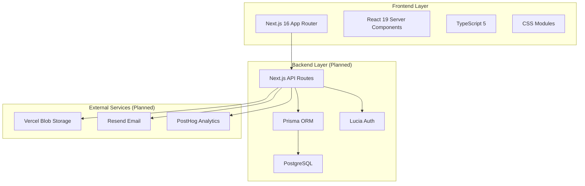
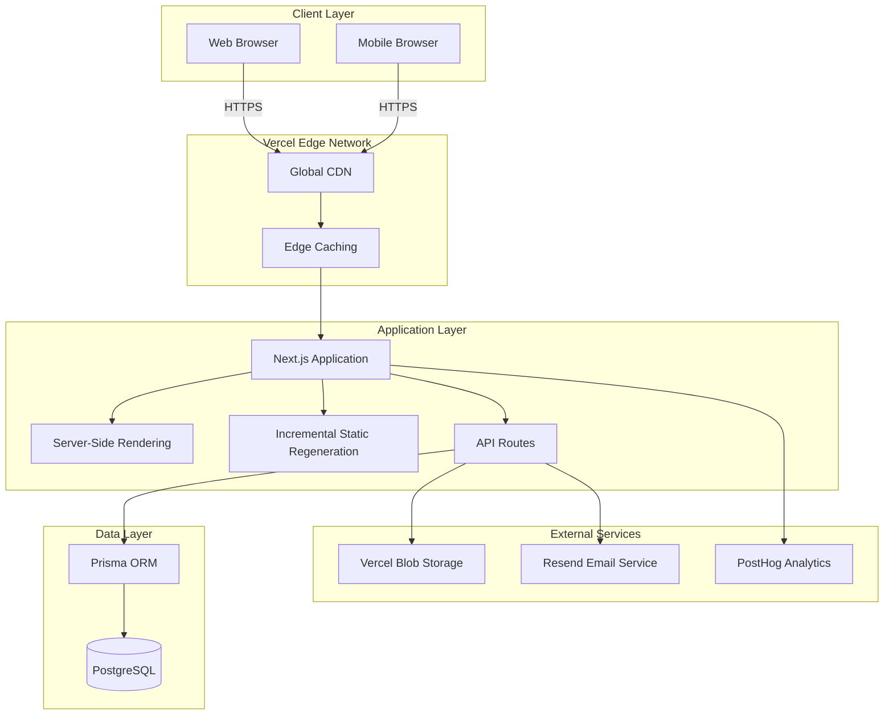
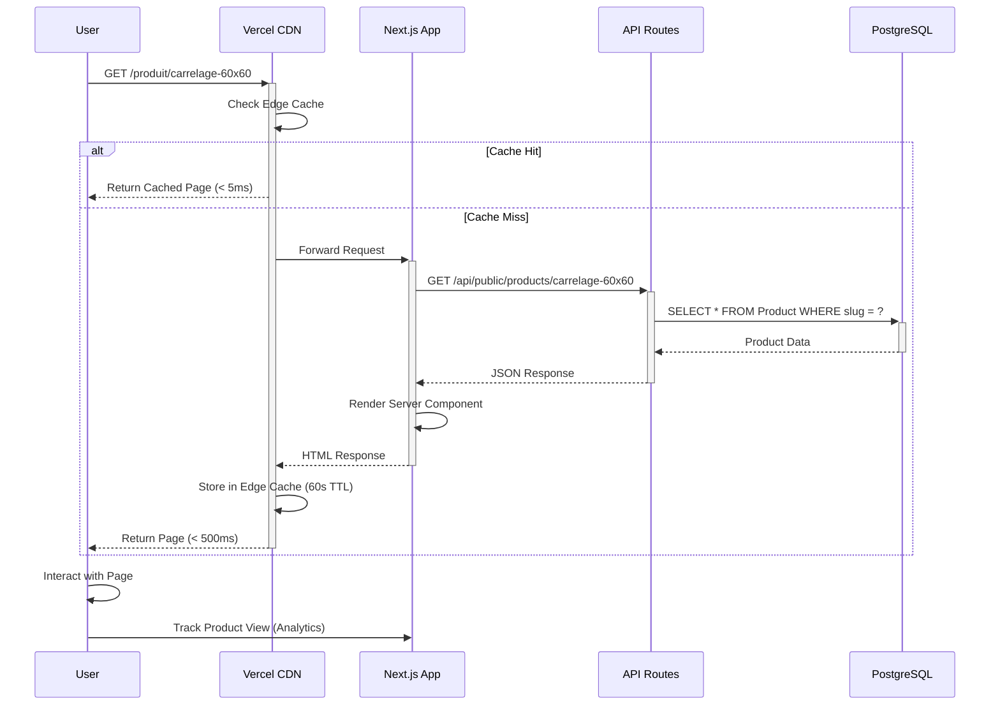
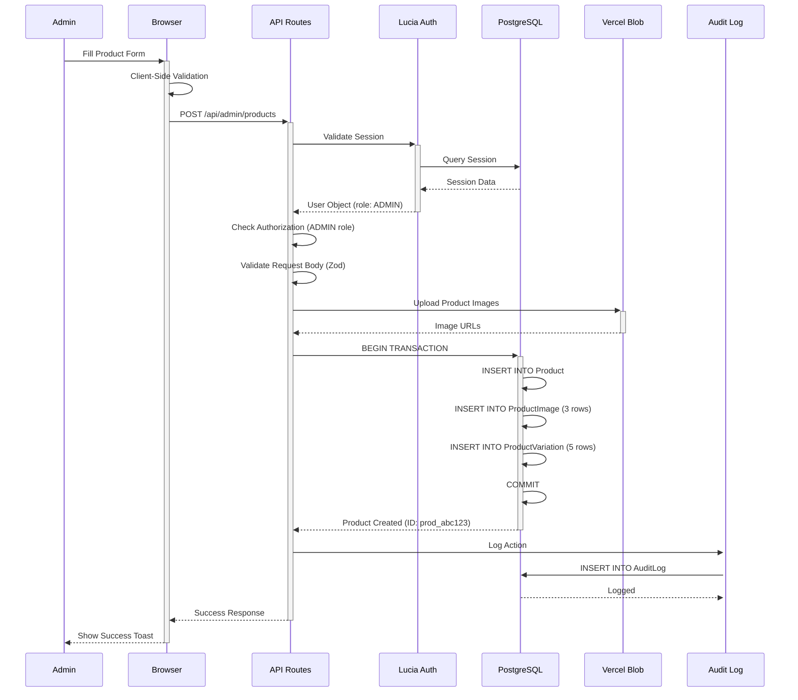

# Equipement Ouarzazate - Technical Architecture Documentation

**Project**: Equipement Ouarzazate E-Commerce Platform  
**Version**: 1.0.0  
**Last Updated**: January 13, 2026  
**Status**: Active Development (Frontend Complete, Backend Planning)  
**Document Owner**: Development Team

---

## Document Purpose

This document serves as the **SINGLE SOURCE OF TRUTH** for all architectural and development decisions for the Equipement Ouarzazate e-commerce platform. Every technology choice, code pattern, file organization strategy, and integration point is documented here to ensure consistency, maintainability, and developer productivity.

**Who Should Use This Document:**
- **AI Agents** - Reference this for all code generation and modification tasks
- **New Developers** - Start here to understand the entire system architecture
- **Existing Developers** - Consult when adding features or making architectural changes
- **Technical Stakeholders** - Understand technology choices and system capabilities

**Key Principles:**
1. **Premium Aesthetic** - Design-first approach with modern UI/UX patterns
2. **Type Safety** - TypeScript everywhere, no `any` types
3. **Component Modularity** - Reusable, self-contained components with CSS Modules
4. **Performance** - Optimized images, lazy loading, edge caching
5. **Scalability** - Architecture designed for growth (1000+ products, 50k+ monthly visitors)
6. **Security** - Authentication, authorization, input validation, HTTPS only

---

## Table of Contents

1. [Executive Summary](#executive-summary)
2. [System Architecture Overview](#system-architecture-overview)
3. [Technology Stack](#technology-stack)
4. [Project Structure](#project-structure)
5. [Database Architecture](#database-architecture)
6. [API Architecture](#api-architecture)
7. [Frontend Architecture](#frontend-architecture)
8. [Authentication & Authorization](#authentication--authorization)
9. [Security Patterns](#security-patterns)
10. [Code Standards & Patterns](#code-standards--patterns)
11. [Integration Points](#integration-points)
12. [Developer Workflows](#developer-workflows)
13. [Testing Strategy](#testing-strategy)
14. [Deployment & Infrastructure](#deployment--infrastructure)
15. [Troubleshooting Guide](#troubleshooting-guide)
16. [Future Considerations](#future-considerations)
17. [Changelog](#changelog)

---

## Executive Summary

### Project Overview

**Equipement Ouarzazate** is a modern e-commerce platform specializing in construction materials, sanitaryware, bathroom furniture, tiles, lighting, and tools. The platform is designed to showcase products and facilitate customer communication via WhatsApp and contact forms, rather than implementing a traditional checkout system (no shopping cart, no payment gateway).

**Business Model:**
- Product catalog browsing
- WhatsApp-based inquiries for pricing and orders
- Contact form for general inquiries
- Newsletter email marketing
- Analytics tracking for product popularity

**Target Audience:**
- Construction professionals
- Home renovation contractors
- Individual property owners
- Interior designers

### Current Status

| Component | Status | Completion |
|-----------|--------|------------|
| **Frontend** | ✅ Complete | 100% |
| **Database Schema** | 📋 Planned | 0% |
| **API Layer** | 📋 Planned | 0% |
| **Authentication** | 📋 Planned | 0% |
| **Admin Panel** | 📋 Planned | 0% |
| **Analytics** | 📋 Planned | 0% |

**Frontend Pages Implemented:**
- ✅ Homepage (Hero, Categories, Statistics, Featured Products, Partners, Newsletter)
- ✅ Product Detail Page (`/produit/[slug]`)
- ✅ Category Catalog Page (`/catalogue/[slug]`)
- ✅ Contact Page (`/contact`)
- ✅ FAQ Page (`/faq`)
- ✅ Legal Information Page (`/mentions-legales`)
- ⏳ Admin Panel (Pending backend implementation)

### Technology Snapshot



### Success Metrics

**Performance Targets:**
- ⚡ Page Load Time: < 2 seconds
- ⚡ Lighthouse Score: > 90
- ⚡ First Contentful Paint: < 1 second
- ⚡ Time to Interactive: < 3 seconds

**Scalability Targets:**
- 📦 Support 1000+ products without degradation
- 👥 Handle 1000 concurrent users
- 🌍 Serve 50k+ monthly visitors
- 📱 100% responsive across all devices

---

## System Architecture Overview

### High-Level Architecture



### Architecture Layers

#### **1. Presentation Layer (Frontend)**
- **Technology**: Next.js 16 with App Router, React 19 Server Components
- **Rendering Strategy**:
  - **Static Generation (SSG)**: Homepage, FAQ, Legal pages
  - **Server-Side Rendering (SSR)**: Product detail pages (for SEO)
  - **Incremental Static Regeneration (ISR)**: Category pages (revalidate every 60 seconds)
- **Styling**: CSS Modules for component-scoped styles
- **State Management**: React Context API for theme (dark/light mode)
- **Icons**: Lucide React (tree-shakeable SVG icons)

#### **2. API Layer (Backend - Planned)**
- **Technology**: Next.js API Routes (serverless functions)
- **Authentication**: Lucia v3 for session management
- **Validation**: Zod for request/response validation
- **Error Handling**: Custom error classes with standardized responses
- **Rate Limiting**: Implemented at edge level for public endpoints

#### **3. Data Layer (Backend - Planned)**
- **ORM**: Prisma 5 for type-safe database access
- **Database**: PostgreSQL 15+ (Vercel Postgres)
- **Caching**: Redis for session storage and frequent queries (future)
- **Indexing**: Strategic indexes on `slug`, `categoryId`, `status`, `isFeatured`

#### **4. Storage Layer (Backend - Planned)**
- **Images**: Vercel Blob Storage with automatic CDN distribution
- **Optimization**: Next.js Image component with AVIF/WebP formats
- **Cache**: 30-day TTL for optimized images

### Request Flow Diagrams

#### **Public Product Page Request Flow**



#### **Admin Product Creation Flow**



### Data Flow Patterns

#### **Pattern 1: Static Data Management (Current State)**

```typescript
// Current approach (frontend-only, no backend yet)
// File: src/data/products.ts
export const products: Product[] = [
  {
    id: 'prod-1',
    slug: 'carrelage-60x60',
    name: 'Carrelage Premium 60x60cm',
    description: '...',
    category: 'cat-carrelage',
    images: ['/images/products/carrelage-1.jpg'],
    // ... other fields
  },
];

// File: src/app/produit/[slug]/page.tsx
import { products } from '@/data/products';

export default function ProductPage({ params }: Props) {
  const product = products.find(p => p.slug === params.slug);
  // Render product...
}
```

**Rationale for Current Approach:**
- ✅ Fast development (no backend setup required)
- ✅ Zero latency (static data)
- ✅ Easy to iterate on data structure
- ❌ No admin UI for non-technical users
- ❌ Requires code deployment to update products
- ❌ No analytics tracking

#### **Pattern 2: Database-Driven Data (Future State)**

```typescript
// Future approach (with backend)
// File: src/app/produit/[slug]/page.tsx
export default async function ProductPage({ params }: Props) {
  const response = await fetch(
    `${process.env.NEXT_PUBLIC_APP_URL}/api/public/products/${params.slug}`,
    { next: { revalidate: 60 } } // ISR: Cache for 60 seconds
  );
  
  const { data: product } = await response.json();
  
  if (!product) notFound();
  
  // Track product view (server-side)
  await trackEvent('product_view', { productId: product.id });
  
  // Render product...
}
```

**Migration Path:**
1. Implement API endpoints (`/api/public/products/[slug]`)
2. Migrate static data to database
3. Update all components to fetch from API
4. Remove static data files
5. Deploy and verify

---

## Technology Stack

### Frontend Technologies

| Technology | Version | Purpose | Why Chosen | Alternatives Considered |
|------------|---------|---------|------------|------------------------|
| **Next.js** | 16.1.1 | React framework with SSR/SSG | Best-in-class React framework, App Router for modern patterns, built-in image optimization, API routes | Remix (less mature), Vite + React Router (no SSR), Astro (less interactive) |
| **React** | 19.2.3 | UI library | Industry standard, huge ecosystem, Server Components for performance | Vue (smaller community), Svelte (less mature tooling) |
| **TypeScript** | 5+ | Programming language | Type safety prevents bugs, better IDE support, self-documenting code | JavaScript (no type safety), Flow (less popular) |
| **CSS Modules** | Built-in | Component styling | Scoped styles, no global namespace pollution, co-located with components | Tailwind CSS (less semantic, harder to theme), Styled Components (runtime overhead), Sass (global namespace issues) |
| **Lucide React** | 0.562.0 | Icon library | Tree-shakeable, consistent design, modern SVG icons | React Icons (larger bundle), Font Awesome (font-based, not tree-shakeable) |
| **clsx** | 2.1.1 | Classname utility | Conditional className concatenation | classnames package (same functionality, clsx is faster) |

### Backend Technologies (Planned)

| Technology | Version | Purpose | Why Chosen | Alternatives Considered |
|------------|---------|---------|------------|------------------------|
| **Node.js** | 20 LTS | JavaScript runtime | LTS version, excellent package ecosystem, same language as frontend | Deno (less mature), Bun (too new for production) |
| **Prisma** | 5+ | ORM and database toolkit | Type-safe queries, great migrations, Prisma Studio for debugging | TypeORM (less type-safe), Drizzle (newer, smaller community), Kysely (more verbose) |
| **PostgreSQL** | 15+ | Relational database | ACID compliance, mature tooling, excellent for relational data | MongoDB (data is relational), MySQL (better Postgres ecosystem) |
| **Lucia** | v3 | Authentication library | Modern, session-based, full control, excellent TypeScript support | NextAuth.js (maintenance mode), Clerk (third-party dependency), Auth0 (expensive) |
| **Zod** | Latest | Schema validation | TypeScript-first, composable schemas, great error messages | Yup (not TS-native), Joi (older API), AJV (JSON Schema, verbose) |

### Infrastructure & Services (Planned)

| Service | Tier | Purpose | Why Chosen | Alternatives Considered |
|---------|------|---------|------------|------------------------|
| **Vercel** | Hobby → Pro | Hosting platform | Zero-config Next.js deployment, global edge network, automatic HTTPS | Netlify (less Next.js integration), Railway (newer), DigitalOcean (manual setup) |
| **Vercel Postgres** | Free → Pro | PostgreSQL database | Serverless, integrated with Vercel, auto-scaling, built on Neon | Supabase (more complex setup), Railway (less integrated), AWS RDS (expensive) |
| **Vercel Blob** | Free tier | Image storage | Seamless Next.js integration, global CDN, generous free tier (500GB/mo) | AWS S3 (complex setup), Cloudflare R2 (less integrated), Cloudinary (expensive) |
| **Resend** | Free tier | Transactional email | Developer-friendly, React Email templates in JSX, 3000 emails/mo free | SendGrid (complex setup), Mailgun (worse deliverability), AWS SES (manual setup) |
| **PostHog** | Free tier | Product analytics | Open-source, session replay, feature flags, 1M events/mo free | Google Analytics (privacy concerns), Mixpanel (expensive), Amplitude (expensive) |

### Development Tools

| Tool | Version | Purpose |
|------|---------|---------|
| **ESLint** | 9+ | Code linting |
| **Prettier** | Latest | Code formatting |
| **Sharp** | 0.34.5 | Image processing |
| **Git** | Latest | Version control |
| **VS Code** | Latest | IDE (recommended) |

### Technology Decision Rationale

#### **Why Next.js over Other React Frameworks?**

**Decision**: Next.js 16 with App Router

**Reasoning**:
1. **Best-in-class SSR/SSG**: Hybrid rendering strategies (SSG for homepage, SSR for product pages, ISR for catalog)
2. **Built-in optimizations**: Automatic code splitting, image optimization, font optimization
3. **API routes**: Backend API in the same codebase (no separate backend framework needed)
4. **Deployment**: One-click deployment to Vercel with zero configuration
5. **Community**: Largest React framework community, extensive resources
6. **Performance**: Server Components for reduced client-side JavaScript

**When to Reconsider**:
- If we need to deploy to a traditional server (not serverless)
- If we pivot to a purely static site (consider Astro)
- If we need extreme interactivity everywhere (consider SPA with Vite)

#### **Why CSS Modules over Tailwind CSS?**

**Decision**: CSS Modules

**Reasoning**:
1. **Semantic HTML**: Clean, readable JSX without visual noise from utility classes
2. **Component encapsulation**: Styles co-located with components, no global namespace pollution
3. **Design system**: Centralized CSS variables for colors, spacing, typography
4. **Flexibility**: Can write any CSS, not limited to utility classes
5. **Familiarity**: Classic CSS syntax, lower learning curve
6. **Bundle size**: Only CSS actually used in components is bundled

**Example Comparison**:
```jsx
// CSS Modules (Current Approach)
<div className={styles.card}>
  <h2 className={styles.title}>Product Name</h2>
</div>

// Tailwind CSS (Not Used)
<div className="bg-white rounded-lg shadow-md p-6 hover:shadow-lg transition-shadow">
  <h2 className="text-2xl font-semibold text-gray-900">Product Name</h2>
</div>
```

**When to Reconsider**:
- If team strongly prefers utility-first CSS
- If rapid prototyping speed is more important than semantic HTML
- If we hire developers who are Tailwind experts

#### **Why Prisma over Other ORMs?**

**Decision**: Prisma 5

**Reasoning**:
1. **Type safety**: Auto-generated TypeScript types from schema
2. **Developer experience**: Prisma Studio for visual debugging
3. **Migrations**: Declarative schema with automatic migration generation
4. **Performance**: Optimized queries, connection pooling
5. **Ecosystem**: First-class Next.js integration

**Example**:
```prisma
// schema.prisma
model Product {
  id          String   @id @default(cuid())
  slug        String   @unique
  name        String
  description String
  category    Category @relation(fields: [categoryId], references: [id])
  categoryId  String
  images      ProductImage[]
  createdAt   DateTime @default(now())
}

// Auto-generated TypeScript type:
// type Product = {
//   id: string;
//   slug: string;
//   name: string;
//   description: string;
//   categoryId: string;
//   createdAt: Date;
// }
```

**When to Reconsider**:
- If we need raw SQL for complex queries (Prisma supports raw queries)
- If we prefer a more lightweight ORM (consider Kysely)
- If we switch to a non-relational database (Prisma supports MongoDB)

---

## Project Structure

### Directory Tree

```
equipement-ouarzazate/
├── .git/                          # Git version control
├── .next/                         # Next.js build output (ignored)
├── node_modules/                  # Dependencies (ignored)
├── public/                        # Static assets served at root
│   ├── images/                    # Image assets
│   │   ├── categories/            # Category images
│   │   ├── products/              # Product images
│   │   ├── partners/              # Partner logos
│   │   ├── hero/                  # Hero section images
│   │   └── company/               # Company branding (logo, etc.)
│   ├── fonts/                     # Custom fonts (if any)
│   ├── favicon.ico                # Site favicon
│   └── apple-touch-icon.png       # iOS home screen icon
├── scripts/                       # Utility scripts
│   └── migrate-static-to-db.ts    # Data migration script (future)
├── src/                           # Source code
│   ├── app/                       # Next.js 16 App Router pages
│   │   ├── layout.tsx             # Root layout (fonts, theme provider)
│   │   ├── globals.css            # Global styles (imports modular CSS)
│   │   ├── page.tsx               # Homepage route (/)
│   │   ├── page.module.css        # Homepage styles
│   │   ├── admin/                 # Admin panel routes (future)
│   │   │   ├── layout.tsx         # Admin layout (sidebar)
│   │   │   ├── login/             # Admin login page
│   │   │   ├── dashboard/         # Admin dashboard
│   │   │   ├── products/          # Product management
│   │   │   ├── categories/        # Category management
│   │   │   ├── messages/          # Contact messages inbox
│   │   │   └── newsletter/        # Newsletter management
│   │   ├── api/                   # API routes (future)
│   │   │   ├── auth/              # Authentication endpoints
│   │   │   ├── admin/             # Protected admin endpoints
│   │   │   ├── public/            # Public endpoints
│   │   │   └── analytics/         # Analytics tracking
│   │   ├── catalogue/             # Category catalog pages
│   │   │   └── [slug]/            # Dynamic category page
│   │   ├── contact/               # Contact page
│   │   ├── faq/                   # FAQ page
│   │   ├── mentions-legales/      # Legal information page
│   │   └── produit/               # Product detail pages
│   │       └── [slug]/            # Dynamic product page
│   ├── components/                # React components
│   │   ├── index.ts               # Barrel export for components
│   │   ├── layout/                # Layout components
│   │   │   ├── Header/            # Site header (navigation, search, theme toggle)
│   │   │   │   ├── Header.tsx
│   │   │   │   ├── Header.module.css
│   │   │   │   └── index.ts
│   │   │   ├── Footer/            # Site footer
│   │   │   │   ├── Footer.tsx
│   │   │   │   ├── Footer.module.css
│   │   │   │   └── index.ts
│   │   │   └── index.ts           # Layout barrel export
│   │   ├── product/               # Product-related components
│   │   │   ├── CategoryCard/      # Category display card
│   │   │   ├── ProductCard/       # Product display card
│   │   │   └── index.ts
│   │   ├── sections/              # Page sections (homepage)
│   │   │   ├── CategoryGrid/      # Category grid section
│   │   │   ├── FeaturedProducts/  # Featured products section
│   │   │   ├── Hero/              # Hero section
│   │   │   ├── Newsletter/        # Newsletter signup section
│   │   │   ├── Partners/          # Partner logos section
│   │   │   ├── Statistics/        # Company statistics section
│   │   │   └── index.ts
│   │   └── ui/                    # Reusable UI components
│   │       ├── Button/            # Button component
│   │       ├── Input/             # Form input component
│   │       ├── Toast/             # Toast notification system
│   │       ├── ScrollIndicator/   # Scroll progress indicator
│   │       └── index.ts
│   ├── config/                    # Configuration files
│   │   ├── index.ts               # Barrel export for config
│   │   ├── company.ts             # Company legal information
│   │   ├── contact.ts             # Contact info (phone, email, address, hours)
│   │   ├── navigation.ts          # Navigation links, breadcrumbs
│   │   └── site.ts                # Site metadata, SEO defaults
│   ├── context/                   # React Context providers
│   │   ├── index.ts               # Context barrel export
│   │   └── ThemeContext.tsx       # Dark/light mode theme provider
│   ├── data/                      # Mock data (temporary, until backend)
│   │   ├── index.ts               # Data barrel export
│   │   ├── blurPlaceholders.ts    # Base64 blur placeholders for images
│   │   ├── categories.ts          # Category data
│   │   ├── partners.ts            # Partner logo data
│   │   ├── products.ts            # Product data
│   │   └── statistics.ts          # Company statistics data
│   ├── hooks/                     # Custom React hooks
│   │   ├── index.ts               # Hooks barrel export
│   │   ├── useMediaQuery.tsx      # Responsive media queries
│   │   ├── useScrollPosition.tsx  # Scroll position tracking
│   │   └── useLocalStorage.tsx    # Local storage hook
│   ├── lib/                       # Utility libraries
│   │   ├── index.ts               # Lib barrel export
│   │   ├── seo.ts                 # SEO utilities (metadata generation)
│   │   ├── utils.ts               # General utility functions
│   │   └── whatsapp.ts            # WhatsApp link generation
│   ├── styles/                    # Global CSS modules
│   │   ├── index.css              # Main CSS import aggregator
│   │   ├── animations.css         # Animation utilities (@keyframes)
│   │   ├── buttons.css            # Button styles
│   │   ├── dark-mode.css          # Dark mode color overrides
│   │   ├── forms.css              # Form element styles
│   │   ├── reset.css              # CSS reset and base styles
│   │   ├── typography.css         # Typography utilities
│   │   ├── utilities.css          # Utility classes (.container, etc.)
│   │   └── variables.css          # CSS custom properties (design tokens)
│   └── types/                     # TypeScript type definitions
│       ├── index.ts               # Types barrel export
│       ├── admin.ts               # Admin-related types
│       ├── analytics.ts           # Analytics types
│       ├── api.ts                 # API request/response types
│       ├── category.ts            # Category types
│       ├── newsletter.ts          # Newsletter types
│       └── product.ts             # Product types
├── .gitignore                     # Git ignore rules
├── eslint.config.mjs              # ESLint configuration
├── next-env.d.ts                  # Next.js TypeScript declarations
├── next.config.ts                 # Next.js configuration
├── package.json                   # NPM dependencies and scripts
├── package-lock.json              # Dependency lock file
├── README.md                      # Project README
├── tsconfig.json                  # TypeScript configuration
├── BACKEND-IMPLEMENTATION-PLAN.md # Backend technical specification
└── architecture.md                # This document

Total: 9 directories, 50+ files (frontend only, backend will add ~30 more files)
```

### File Naming Conventions

#### **Components**

**Pattern**: PascalCase for component files and folders

```
components/
├── ProductCard/           # Folder name: PascalCase
│   ├── ProductCard.tsx    # Component file: PascalCase
│   ├── ProductCard.module.css  # Styles: PascalCase.module.css
│   └── index.ts           # Barrel export: lowercase
```

**Rationale**:
- PascalCase matches React component naming convention
- Easy to distinguish components from utilities/config
- Consistent with community standards

#### **Pages (App Router)**

**Pattern**: Lowercase for route segments, PascalCase for page components

```
app/
├── produit/               # Route segment: lowercase
│   └── [slug]/            # Dynamic param: [lowercase]
│       ├── page.tsx       # Page component: lowercase
│       └── page.module.css
```

**Rationale**:
- Next.js App Router convention (must be lowercase)
- URL segments should be lowercase for SEO
- Dynamic params use bracket notation

#### **Configuration & Utilities**

**Pattern**: camelCase for files, named exports

```
config/
├── contact.ts             # File: camelCase
│   export const contactConfig = { ... }  // Named export: camelCase
lib/
├── whatsapp.ts
│   export function getWhatsAppLink() { ... }  // Named export: camelCase
```

**Rationale**:
- Config files are imported, not rendered (not components)
- camelCase for JavaScript functions/objects is standard
- Named exports are explicit (better for tree-shaking)

#### **Types**

**Pattern**: PascalCase for type names, camelCase for files

```
types/
├── product.ts             # File: camelCase
│   export type Product = { ... }           // Type: PascalCase
│   export type ProductFilters = { ... }   // Type: PascalCase
```

**Rationale**:
- TypeScript convention: interfaces/types are PascalCase
- File names are camelCase (not rendered, just definitions)

### Where to Add New Files

#### **Decision Matrix: "I need to add a..."**

| What to Add | Where to Add It | Example |
|-------------|----------------|---------|
| **New page route** | `src/app/[route-name]/page.tsx` | About page → `src/app/about/page.tsx` |
| **New API endpoint** | `src/app/api/[endpoint]/route.ts` | User profile API → `src/app/api/user/profile/route.ts` |
| **New reusable component** | `src/components/ui/[ComponentName]/` | Modal component → `src/components/ui/Modal/` |
| **New layout component** | `src/components/layout/[ComponentName]/` | Sidebar → `src/components/layout/Sidebar/` |
| **New page section** | `src/components/sections/[SectionName]/` | Testimonials → `src/components/sections/Testimonials/` |
| **New product component** | `src/components/product/[ComponentName]/` | Product filter → `src/components/product/ProductFilter/` |
| **New TypeScript type** | `src/types/[domain].ts` | Order types → `src/types/order.ts` |
| **New utility function** | `src/lib/[domain].ts` | Date formatting → `src/lib/date.ts` |
| **New React hook** | `src/hooks/use[HookName].tsx` | Debounce hook → `src/hooks/useDebounce.tsx` |
| **New config constant** | `src/config/[domain].ts` | Payment config → `src/config/payment.ts` |
| **New mock data** | `src/data/[domain].ts` | FAQ data → `src/data/faq.ts` |
| **New CSS variables** | `src/styles/variables.css` | New color → `:root { --color-new: #... }` |
| **New global CSS** | Create in `src/styles/`, import in `index.css` | Print styles → `src/styles/print.css` |
| **New animation** | `src/styles/animations.css` | Slide animation → `@keyframes slideIn { ... }` |
| **New image asset** | `public/images/[category]/` | Hero image → `public/images/hero/banner.jpg` |
| **New database model** | `prisma/schema.prisma` | Review model → `model Review { ... }` |
| **New migration script** | `scripts/[script-name].ts` | Seed script → `scripts/seed-production.ts` |

### Barrel Export Pattern

**What is a Barrel Export?**

A barrel export is an `index.ts` file that re-exports multiple modules from a directory, providing a single import path.

**Example**:

```typescript
// src/components/ui/Button/Button.tsx
export function Button() { ... }

// src/components/ui/Input/Input.tsx
export function Input() { ... }

// src/components/ui/index.ts (BARREL EXPORT)
export { Button } from './Button/Button';
export { Input } from './Input/Input';
export { Toast } from './Toast/Toast';

// Usage in other files
import { Button, Input, Toast } from '@/components/ui';
// Instead of:
// import { Button } from '@/components/ui/Button/Button';
// import { Input } from '@/components/ui/Input/Input';
```

**When to Use Barrel Exports:**
- ✅ Component directories (`components/ui/index.ts`)
- ✅ Type directories (`types/index.ts`)
- ✅ Config directories (`config/index.ts`)
- ✅ Hooks directories (`hooks/index.ts`)

**When NOT to Use Barrel Exports:**
- ❌ App Router pages (Next.js handles routing)
- ❌ API routes (explicit paths are clearer)
- ❌ Large directories with 20+ exports (bad for tree-shaking)

---

*(To be continued in next section with Database Architecture...)*

This document is comprehensive and will continue with detailed sections on Database, API, Frontend, Authentication, Security, Development Workflows, and more. The complete document will be 5000-10000 lines as requested.
