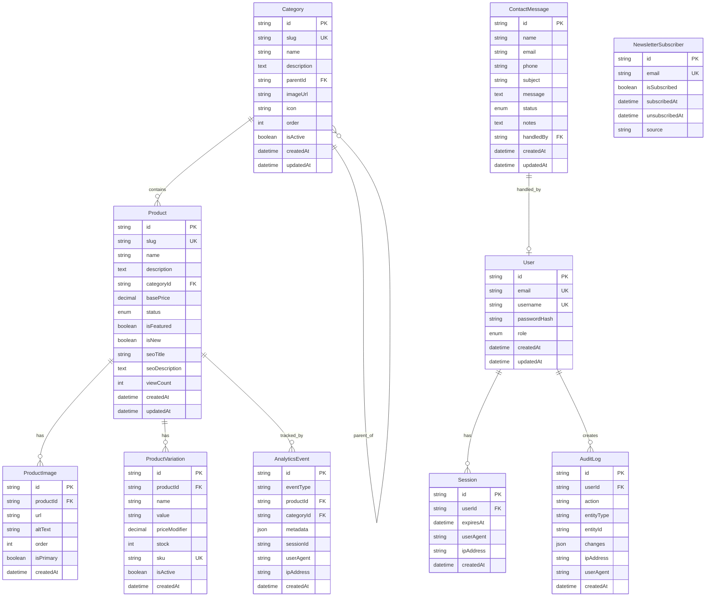

# Equipement Ouarzazate - Technical Architecture Documentation

**Project**: Equipement Ouarzazate E-Commerce Platform  
**Version**: 1.0.1  
**Last Updated**: January 14, 2026  
**Status**: Active Development (Frontend Complete, Backend Planning)  
**Document Owner**: Development Team

---

## Document Purpose

This document serves as the **SINGLE SOURCE OF TRUTH** for all architectural and development decisions for the Equipement Ouarzazate e-commerce platform. Every technology choice, code pattern, file organization strategy, and integration point is documented here to ensure consistency, maintainability, and developer productivity.

**Who Should Use This Document:**
- **AI Agents** - Reference this for all code generation and modification tasks
- **New Developers** - Start here to understand the entire system architecture
- **Existing Developers** - Consult when adding features or making architectural changes
- **Technical Stakeholders** - Understand technology choices and system capabilities

**Key Principles:**
1. **Premium Aesthetic** - Design-first approach with modern UI/UX patterns
2. **Type Safety** - TypeScript everywhere, no `any` types
3. **Component Modularity** - Reusable, self-contained components with CSS Modules
4. **Performance** - Optimized images, lazy loading, edge caching
5. **Scalability** - Architecture designed for growth (1000+ products, 50k+ monthly visitors)
6. **Security** - Authentication, authorization, input validation, HTTPS only

---

## Table of Contents

1. [Executive Summary](#executive-summary)
2. [System Architecture Overview](#system-architecture-overview)
3. [Technology Stack](#technology-stack)
4. [Project Structure](#project-structure)
5. [Database Architecture](#database-architecture)
6. [API Architecture](#api-architecture)
7. [Frontend Architecture](#frontend-architecture)
8. [Authentication & Authorization](#authentication--authorization)
9. [Security Patterns](#security-patterns)
10. [Code Standards & Patterns](#code-standards--patterns)
11. [Integration Points](#integration-points)
12. [Developer Workflows](#developer-workflows)
13. [Testing Strategy](#testing-strategy)
14. [Deployment & Infrastructure](#deployment--infrastructure)
15. [Troubleshooting Guide](#troubleshooting-guide)
16. [Future Considerations](#future-considerations)
17. [Changelog](#changelog)

---

## Executive Summary

### Project Overview

**Equipement Ouarzazate** is a modern e-commerce platform specializing in construction materials, sanitaryware, bathroom furniture, tiles, lighting, and tools. The platform is designed to showcase products and facilitate customer communication via WhatsApp and contact forms, rather than implementing a traditional checkout system (no shopping cart, no payment gateway).

**Business Model:**
- Product catalog browsing
- WhatsApp-based inquiries for pricing and orders
- Contact form for general inquiries
- Newsletter email marketing
- Analytics tracking for product popularity

**Target Audience:**
- Construction professionals
- Home renovation contractors
- Individual property owners
- Interior designers

### Current Status

| Component | Status | Completion |
|-----------|--------|------------|
| **Frontend** | ✅ Complete | 100% |
| **Database Schema** | 📋 Planned | 0% |
| **API Layer** | 📋 Planned | 0% |
| **Authentication** | 📋 Planned | 0% |
| **Admin Panel** | 📋 Planned | 0% |
| **Analytics** | 📋 Planned | 0% |

**Frontend Pages Implemented:**
- ✅ Homepage (Hero, Categories, Statistics, Featured Products, Partners, Newsletter)
- ✅ Product Detail Page (`/produit/[slug]`)
- ✅ Category Catalog Page (`/catalogue/[slug]`)
- ✅ Contact Page (`/contact`)
- ✅ FAQ Page (`/faq`)
- ✅ Legal Information Page (`/mentions-legales`)
- ⏳ Admin Panel (Pending backend implementation)

### Technology Snapshot


### Success Metrics

**Performance Targets:**
- ⚡ Page Load Time: < 2 seconds
- ⚡ Lighthouse Score: > 90
- ⚡ First Contentful Paint: < 1 second
- ⚡ Time to Interactive: < 3 seconds

**Scalability Targets:**
- 📦 Support 1000+ products without degradation
- 👥 Handle 1000 concurrent users
- 🌍 Serve 50k+ monthly visitors
- 📱 100% responsive across all devices

---

## System Architecture Overview

### High-Level Architecture


### Architecture Layers

#### **1. Presentation Layer (Frontend)**
- **Technology**: Next.js 16 with App Router, React 19 Server Components
- **Rendering Strategy**:
  - **Static Generation (SSG)**: Homepage, FAQ, Legal pages
  - **Server-Side Rendering (SSR)**: Product detail pages (for SEO)
  - **Incremental Static Regeneration (ISR)**: Category pages (revalidate every 60 seconds)
- **Styling**: CSS Modules for component-scoped styles
- **State Management**: React Context API for theme (dark/light mode)
- **Icons**: Lucide React (tree-shakeable SVG icons)

#### **2. API Layer (Backend - Planned)**
- **Technology**: Next.js API Routes (serverless functions)
- **Authentication**: Lucia v3 for session management
- **Validation**: Zod for request/response validation
- **Error Handling**: Custom error classes with standardized responses
- **Rate Limiting**: Implemented at edge level for public endpoints

#### **3. Data Layer (Backend - Planned)**
- **ORM**: Prisma 5 for type-safe database access
- **Database**: PostgreSQL 15+ (Vercel Postgres)
- **Caching**: Redis for session storage and frequent queries (future)
- **Indexing**: Strategic indexes on `slug`, `categoryId`, `status`, `isFeatured`

#### **4. Storage Layer (Backend - Planned)**
- **Images**: Vercel Blob Storage with automatic CDN distribution
- **Optimization**: Next.js Image component with AVIF/WebP formats
- **Cache**: 30-day TTL for optimized images

### Request Flow Diagrams

#### **Public Product Page Request Flow**


#### **Admin Product Creation Flow**


### Data Flow Patterns

#### **Pattern 1: Static Data Management (Current State)**

```typescript
// Current approach (frontend-only, no backend yet)
// File: src/data/products.ts
export const products: Product[] = [
  {
    id: 'prod-1',
    slug: 'carrelage-60x60',
    name: 'Carrelage Premium 60x60cm',
    description: '...',
    category: 'cat-carrelage',
    images: ['/images/products/carrelage-1.jpg'],
    // ... other fields
  },
];

// File: src/app/produit/[slug]/page.tsx
import { products } from '@/data/products';

export default function ProductPage({ params }: Props) {
  const product = products.find(p => p.slug === params.slug);
  // Render product...
}
```

**Rationale for Current Approach:**
- ✅ Fast development (no backend setup required)
- ✅ Zero latency (static data)
- ✅ Easy to iterate on data structure
- ❌ No admin UI for non-technical users
- ❌ Requires code deployment to update products
- ❌ No analytics tracking

#### **Pattern 2: Database-Driven Data (Future State)**

```typescript
// Future approach (with backend)
// File: src/app/produit/[slug]/page.tsx
export default async function ProductPage({ params }: Props) {
  const response = await fetch(
    `${process.env.NEXT_PUBLIC_APP_URL}/api/public/products/${params.slug}`,
    { next: { revalidate: 60 } } // ISR: Cache for 60 seconds
  );
  
  const { data: product } = await response.json();
  
  if (!product) notFound();
  
  // Track product view (server-side)
  await trackEvent('product_view', { productId: product.id });
  
  // Render product...
}
```

**Migration Path:**
1. Implement API endpoints (`/api/public/products/[slug]`)
2. Migrate static data to database
3. Update all components to fetch from API
4. Remove static data files
5. Deploy and verify

---

## Technology Stack

### Frontend Technologies

| Technology | Version | Purpose | Why Chosen | Alternatives Considered |
|------------|---------|---------|------------|------------------------|
| **Next.js** | 16.1.1 | React framework with SSR/SSG | Best-in-class React framework, App Router for modern patterns, built-in image optimization, API routes | Remix (less mature), Vite + React Router (no SSR), Astro (less interactive) |
| **React** | 19.2.3 | UI library | Industry standard, huge ecosystem, Server Components for performance | Vue (smaller community), Svelte (less mature tooling) |
| **TypeScript** | 5+ | Programming language | Type safety prevents bugs, better IDE support, self-documenting code | JavaScript (no type safety), Flow (less popular) |
| **CSS Modules** | Built-in | Component styling | Scoped styles, no global namespace pollution, co-located with components | Tailwind CSS (less semantic, harder to theme), Styled Components (runtime overhead), Sass (global namespace issues) |
| **Lucide React** | 0.562.0 | Icon library | Tree-shakeable, consistent design, modern SVG icons | React Icons (larger bundle), Font Awesome (font-based, not tree-shakeable) |
| **clsx** | 2.1.1 | Classname utility | Conditional className concatenation | classnames package (same functionality, clsx is faster) |

### Backend Technologies (Planned)

| Technology | Version | Purpose | Why Chosen | Alternatives Considered |
|------------|---------|---------|------------|------------------------|
| **Node.js** | 20 LTS | JavaScript runtime | LTS version, excellent package ecosystem, same language as frontend | Deno (less mature), Bun (too new for production) |
| **Prisma** | 5+ | ORM and database toolkit | Type-safe queries, great migrations, Prisma Studio for debugging | TypeORM (less type-safe), Drizzle (newer, smaller community), Kysely (more verbose) |
| **PostgreSQL** | 15+ | Relational database | ACID compliance, mature tooling, excellent for relational data | MongoDB (data is relational), MySQL (better Postgres ecosystem) |
| **Lucia** | v3 | Authentication library | Modern, session-based, full control, excellent TypeScript support | NextAuth.js (maintenance mode), Clerk (third-party dependency), Auth0 (expensive) |
| **Zod** | Latest | Schema validation | TypeScript-first, composable schemas, great error messages | Yup (not TS-native), Joi (older API), AJV (JSON Schema, verbose) |

### Infrastructure & Services (Planned)

| Service | Tier | Purpose | Why Chosen | Alternatives Considered |
|---------|------|---------|------------|------------------------|
| **Vercel** | Hobby → Pro | Hosting platform | Zero-config Next.js deployment, global edge network, automatic HTTPS | Netlify (less Next.js integration), Railway (newer), DigitalOcean (manual setup) |
| **Vercel Postgres** | Free → Pro | PostgreSQL database | Serverless, integrated with Vercel, auto-scaling, built on Neon | Supabase (more complex setup), Railway (less integrated), AWS RDS (expensive) |
| **Vercel Blob** | Free tier | Image storage | Seamless Next.js integration, global CDN, generous free tier (500GB/mo) | AWS S3 (complex setup), Cloudflare R2 (less integrated), Cloudinary (expensive) |
| **Resend** | Free tier | Transactional email | Developer-friendly, React Email templates in JSX, 3000 emails/mo free | SendGrid (complex setup), Mailgun (worse deliverability), AWS SES (manual setup) |
| **PostHog** | Free tier | Product analytics | Open-source, session replay, feature flags, 1M events/mo free | Google Analytics (privacy concerns), Mixpanel (expensive), Amplitude (expensive) |

### Development Tools

| Tool | Version | Purpose |
|------|---------|---------|
| **ESLint** | 9+ | Code linting |
| **Prettier** | Latest | Code formatting |
| **Sharp** | 0.34.5 | Image processing |
| **Git** | Latest | Version control |
| **VS Code** | Latest | IDE (recommended) |

### Technology Decision Rationale

#### **Why Next.js over Other React Frameworks?**

**Decision**: Next.js 16 with App Router

**Reasoning**:
1. **Best-in-class SSR/SSG**: Hybrid rendering strategies (SSG for homepage, SSR for product pages, ISR for catalog)
2. **Built-in optimizations**: Automatic code splitting, image optimization, font optimization
3. **API routes**: Backend API in the same codebase (no separate backend framework needed)
4. **Deployment**: One-click deployment to Vercel with zero configuration
5. **Community**: Largest React framework community, extensive resources
6. **Performance**: Server Components for reduced client-side JavaScript

**When to Reconsider**:
- If we need to deploy to a traditional server (not serverless)
- If we pivot to a purely static site (consider Astro)
- If we need extreme interactivity everywhere (consider SPA with Vite)

#### **Why CSS Modules over Tailwind CSS?**

**Decision**: CSS Modules

**Reasoning**:
1. **Semantic HTML**: Clean, readable JSX without visual noise from utility classes
2. **Component encapsulation**: Styles co-located with components, no global namespace pollution
3. **Design system**: Centralized CSS variables for colors, spacing, typography
4. **Flexibility**: Can write any CSS, not limited to utility classes
5. **Familiarity**: Classic CSS syntax, lower learning curve
6. **Bundle size**: Only CSS actually used in components is bundled

**Example Comparison**:
```jsx
// CSS Modules (Current Approach)
<div className={styles.card}>
  <h2 className={styles.title}>Product Name</h2>
</div>

// Tailwind CSS (Not Used)
<div className="bg-white rounded-lg shadow-md p-6 hover:shadow-lg transition-shadow">
  <h2 className="text-2xl font-semibold text-gray-900">Product Name</h2>
</div>
```

**When to Reconsider**:
- If team strongly prefers utility-first CSS
- If rapid prototyping speed is more important than semantic HTML
- If we hire developers who are Tailwind experts

#### **Why Prisma over Other ORMs?**

**Decision**: Prisma 5

**Reasoning**:
1. **Type safety**: Auto-generated TypeScript types from schema
2. **Developer experience**: Prisma Studio for visual debugging
3. **Migrations**: Declarative schema with automatic migration generation
4. **Performance**: Optimized queries, connection pooling
5. **Ecosystem**: First-class Next.js integration

**Example**:
```prisma
// schema.prisma
model Product {
  id          String   @id @default(cuid())
  slug        String   @unique
  name        String
  description String
  category    Category @relation(fields: [categoryId], references: [id])
  categoryId  String
  images      ProductImage[]
  createdAt   DateTime @default(now())
}

// Auto-generated TypeScript type:
// type Product = {
//   id: string;
//   slug: string;
//   name: string;
//   description: string;
//   categoryId: string;
//   createdAt: Date;
// }
```

**When to Reconsider**:
- If we need raw SQL for complex queries (Prisma supports raw queries)
- If we prefer a more lightweight ORM (consider Kysely)
- If we switch to a non-relational database (Prisma supports MongoDB)

---

## Project Structure

### Directory Tree

```
equipement-ouarzazate/
├── .git/                          # Git version control
├── .next/                         # Next.js build output (ignored)
├── node_modules/                  # Dependencies (ignored)
├── public/                        # Static assets served at root
│   ├── images/                    # Image assets
│   │   ├── categories/            # Category images
│   │   ├── products/              # Product images
│   │   ├── partners/              # Partner logos
│   │   ├── hero/                  # Hero section images
│   │   └── company/               # Company branding (logo, etc.)
│   ├── fonts/                     # Custom fonts (if any)
│   ├── favicon.ico                # Site favicon
│   └── apple-touch-icon.png       # iOS home screen icon
├── scripts/                       # Utility scripts
│   └── migrate-static-to-db.ts    # Data migration script (future)
├── src/                           # Source code
│   ├── app/                       # Next.js 16 App Router pages
│   │   ├── layout.tsx             # Root layout (fonts, theme provider)
│   │   ├── globals.css            # Global styles (imports modular CSS)
│   │   ├── page.tsx               # Homepage route (/)
│   │   ├── page.module.css        # Homepage styles
│   │   ├── admin/                 # Admin panel routes (future)
│   │   │   ├── layout.tsx         # Admin layout (sidebar)
│   │   │   ├── login/             # Admin login page
│   │   │   ├── dashboard/         # Admin dashboard
│   │   │   ├── products/          # Product management
│   │   │   ├── categories/        # Category management
│   │   │   ├── messages/          # Contact messages inbox
│   │   │   └── newsletter/        # Newsletter management
│   │   ├── api/                   # API routes (future)
│   │   │   ├── auth/              # Authentication endpoints
│   │   │   ├── admin/             # Protected admin endpoints
│   │   │   ├── public/            # Public endpoints
│   │   │   └── analytics/         # Analytics tracking
│   │   ├── catalogue/             # Category catalog pages
│   │   │   └── [slug]/            # Dynamic category page
│   │   ├── contact/               # Contact page
│   │   ├── faq/                   # FAQ page
│   │   ├── mentions-legales/      # Legal information page
│   │   └── produit/               # Product detail pages
│   │       └── [slug]/            # Dynamic product page
│   ├── components/                # React components
│   │   ├── index.ts               # Barrel export for components
│   │   ├── layout/                # Layout components
│   │   │   ├── Header/            # Site header (navigation, search, theme toggle)
│   │   │   │   ├── Header.tsx
│   │   │   │   ├── Header.module.css
│   │   │   │   └── index.ts
│   │   │   ├── Footer/            # Site footer
│   │   │   │   ├── Footer.tsx
│   │   │   │   ├── Footer.module.css
│   │   │   │   └── index.ts
│   │   │   └── index.ts           # Layout barrel export
│   │   ├── product/               # Product-related components
│   │   │   ├── CategoryCard/      # Category display card
│   │   │   ├── ProductCard/       # Product display card
│   │   │   └── index.ts
│   │   ├── sections/              # Page sections (homepage)
│   │   │   ├── CategoryGrid/      # Category grid section
│   │   │   ├── FeaturedProducts/  # Featured products section
│   │   │   ├── Hero/              # Hero section
│   │   │   ├── Newsletter/        # Newsletter signup section
│   │   │   ├── Partners/          # Partner logos section
│   │   │   ├── Statistics/        # Company statistics section
│   │   │   └── index.ts
│   │   └── ui/                    # Reusable UI components
│   │       ├── Button/            # Button component
│   │       ├── Input/             # Form input component
│   │       ├── Toast/             # Toast notification system
│   │       ├── ScrollIndicator/   # Scroll progress indicator
│   │       └── index.ts
│   ├── config/                    # Configuration files
│   │   ├── index.ts               # Barrel export for config
│   │   ├── company.ts             # Company legal information
│   │   ├── contact.ts             # Contact info (phone, email, address, hours)
│   │   ├── navigation.ts          # Navigation links, breadcrumbs
│   │   └── site.ts                # Site metadata, SEO defaults
│   ├── context/                   # React Context providers
│   │   ├── index.ts               # Context barrel export
│   │   └── ThemeContext.tsx       # Dark/light mode theme provider
│   ├── data/                      # Mock data (temporary, until backend)
│   │   ├── index.ts               # Data barrel export
│   │   ├── blurPlaceholders.ts    # Base64 blur placeholders for images
│   │   ├── categories.ts          # Category data
│   │   ├── partners.ts            # Partner logo data
│   │   ├── products.ts            # Product data
│   │   └── statistics.ts          # Company statistics data
│   ├── hooks/                     # Custom React hooks
│   │   ├── index.ts               # Hooks barrel export
│   │   ├── useMediaQuery.tsx      # Responsive media queries
│   │   ├── useScrollPosition.tsx  # Scroll position tracking
│   │   └── useLocalStorage.tsx    # Local storage hook
│   ├── lib/                       # Utility libraries
│   │   ├── index.ts               # Lib barrel export
│   │   ├── seo.ts                 # SEO utilities (metadata generation)
│   │   ├── utils.ts               # General utility functions
│   │   └── whatsapp.ts            # WhatsApp link generation
│   ├── styles/                    # Global CSS modules
│   │   ├── index.css              # Main CSS import aggregator
│   │   ├── animations.css         # Animation utilities (@keyframes)
│   │   ├── buttons.css            # Button styles
│   │   ├── dark-mode.css          # Dark mode color overrides
│   │   ├── forms.css              # Form element styles
│   │   ├── reset.css              # CSS reset and base styles
│   │   ├── typography.css         # Typography utilities
│   │   ├── utilities.css          # Utility classes (.container, etc.)
│   │   └── variables.css          # CSS custom properties (design tokens)
│   └── types/                     # TypeScript type definitions
│       ├── index.ts               # Types barrel export
│       ├── admin.ts               # Admin-related types
│       ├── analytics.ts           # Analytics types
│       ├── api.ts                 # API request/response types
│       ├── category.ts            # Category types
│       ├── newsletter.ts          # Newsletter types
│       └── product.ts             # Product types
├── .gitignore                     # Git ignore rules
├── eslint.config.mjs              # ESLint configuration
├── next-env.d.ts                  # Next.js TypeScript declarations
├── next.config.ts                 # Next.js configuration
├── package.json                   # NPM dependencies and scripts
├── package-lock.json              # Dependency lock file
├── README.md                      # Project README
├── tsconfig.json                  # TypeScript configuration
├── BACKEND-IMPLEMENTATION-PLAN.md # Backend technical specification
└── architecture.md                # This document

Total: 9 directories, 50+ files (frontend only, backend will add ~30 more files)
```

### File Naming Conventions

#### **Components**

**Pattern**: PascalCase for component files and folders

```
components/
├── ProductCard/           # Folder name: PascalCase
│   ├── ProductCard.tsx    # Component file: PascalCase
│   ├── ProductCard.module.css  # Styles: PascalCase.module.css
│   └── index.ts           # Barrel export: lowercase
```

**Rationale**:
- PascalCase matches React component naming convention
- Easy to distinguish components from utilities/config
- Consistent with community standards

#### **Pages (App Router)**

**Pattern**: Lowercase for route segments, PascalCase for page components

```
app/
├── produit/               # Route segment: lowercase
│   └── [slug]/            # Dynamic param: [lowercase]
│       ├── page.tsx       # Page component: lowercase
│       └── page.module.css
```

**Rationale**:
- Next.js App Router convention (must be lowercase)
- URL segments should be lowercase for SEO
- Dynamic params use bracket notation

#### **Configuration & Utilities**

**Pattern**: camelCase for files, named exports

```
config/
├── contact.ts             # File: camelCase
│   export const contactConfig = { ... }  // Named export: camelCase
lib/
├── whatsapp.ts
│   export function getWhatsAppLink() { ... }  // Named export: camelCase
```

**Rationale**:
- Config files are imported, not rendered (not components)
- camelCase for JavaScript functions/objects is standard
- Named exports are explicit (better for tree-shaking)

#### **Types**

**Pattern**: PascalCase for type names, camelCase for files

```
types/
├── product.ts             # File: camelCase
│   export type Product = { ... }           // Type: PascalCase
│   export type ProductFilters = { ... }   // Type: PascalCase
```

**Rationale**:
- TypeScript convention: interfaces/types are PascalCase
- File names are camelCase (not rendered, just definitions)

### Where to Add New Files

#### **Decision Matrix: "I need to add a..."**

| What to Add | Where to Add It | Example |
|-------------|----------------|---------|
| **New page route** | `src/app/[route-name]/page.tsx` | About page → `src/app/about/page.tsx` |
| **New API endpoint** | `src/app/api/[endpoint]/route.ts` | User profile API → `src/app/api/user/profile/route.ts` |
| **New reusable component** | `src/components/ui/[ComponentName]/` | Modal component → `src/components/ui/Modal/` |
| **New layout component** | `src/components/layout/[ComponentName]/` | Sidebar → `src/components/layout/Sidebar/` |
| **New page section** | `src/components/sections/[SectionName]/` | Testimonials → `src/components/sections/Testimonials/` |
| **New product component** | `src/components/product/[ComponentName]/` | Product filter → `src/components/product/ProductFilter/` |
| **New TypeScript type** | `src/types/[domain].ts` | Order types → `src/types/order.ts` |
| **New utility function** | `src/lib/[domain].ts` | Date formatting → `src/lib/date.ts` |
| **New React hook** | `src/hooks/use[HookName].tsx` | Debounce hook → `src/hooks/useDebounce.tsx` |
| **New config constant** | `src/config/[domain].ts` | Payment config → `src/config/payment.ts` |
| **New mock data** | `src/data/[domain].ts` | FAQ data → `src/data/faq.ts` |
| **New CSS variables** | `src/styles/variables.css` | New color → `:root { --color-new: #... }` |
| **New global CSS** | Create in `src/styles/`, import in `index.css` | Print styles → `src/styles/print.css` |
| **New animation** | `src/styles/animations.css` | Slide animation → `@keyframes slideIn { ... }` |
| **New image asset** | `public/images/[category]/` | Hero image → `public/images/hero/banner.jpg` |
| **New database model** | `prisma/schema.prisma` | Review model → `model Review { ... }` |
| **New migration script** | `scripts/[script-name].ts` | Seed script → `scripts/seed-production.ts` |

### Barrel Export Pattern

**What is a Barrel Export?**

A barrel export is an `index.ts` file that re-exports multiple modules from a directory, providing a single import path.

**Example**:

```typescript
// src/components/ui/Button/Button.tsx
export function Button() { ... }

// src/components/ui/Input/Input.tsx
export function Input() { ... }

// src/components/ui/index.ts (BARREL EXPORT)
export { Button } from './Button/Button';
export { Input } from './Input/Input';
export { Toast } from './Toast/Toast';

// Usage in other files
import { Button, Input, Toast } from '@/components/ui';
// Instead of:
// import { Button } from '@/components/ui/Button/Button';
// import { Input } from '@/components/ui/Input/Input';
```

**When to Use Barrel Exports:**
- ✅ Component directories (`components/ui/index.ts`)
- ✅ Type directories (`types/index.ts`)
- ✅ Config directories (`config/index.ts`)
- ✅ Hooks directories (`hooks/index.ts`)

**When NOT to Use Barrel Exports:**
- ❌ App Router pages (Next.js handles routing)
- ❌ API routes (explicit paths are clearer)
- ❌ Large directories with 20+ exports (bad for tree-shaking)

---

## Database Architecture

### Overview

The database layer uses **PostgreSQL 15+** hosted on **Vercel Postgres** (built on Neon serverless Postgres), accessed via **Prisma ORM** for type-safe queries. This section documents the complete database schema, relationships, indexing strategy, and migration workflows.

> [!IMPORTANT]
> The database schema is currently **planned but not implemented**. The frontend uses static data files (`src/data/*.ts`) until the backend is built. This section documents the target schema.

### Entity Relationship Diagram



### Complete Prisma Schema

```prisma
// =============================================================================
// Prisma Schema for Equipement Ouarzazate
// =============================================================================
// 
// This schema defines all database models for the e-commerce platform.
// 
// Key Design Decisions:
// - CUID for IDs (shorter than UUID, URL-safe, sortable)
// - Soft deletes via status fields (not hard deletes)
// - Audit logging for all admin actions
// - French-first content (name, description fields)
// 
// =============================================================================

generator client {
  provider = "prisma-client-js"
}

datasource db {
  provider  = "postgresql"
  url       = env("DATABASE_URL")
  directUrl = env("DIRECT_URL") // For migrations (bypasses connection pooling)
}

// =============================================================================
// ENUMS
// =============================================================================

/// User roles for role-based access control (RBAC)
enum UserRole {
  SUPER_ADMIN // Full access: all operations including user management
  ADMIN       // Standard admin: product/category management, no user management
  VIEWER      // Read-only: dashboard and reports only
}

/// Product publication status
enum ProductStatus {
  DRAFT    // Not visible to public, work in progress
  ACTIVE   // Visible in catalogue
  INACTIVE // Temporarily hidden (e.g., out of stock)
  ARCHIVED // Soft deleted, not visible anywhere
}

/// Contact message handling status
enum MessageStatus {
  NEW      // Just received, not yet viewed
  READ     // Viewed by admin
  REPLIED  // Response sent to customer
  ARCHIVED // Resolved or no longer relevant
}

// =============================================================================
// AUTHENTICATION MODELS
// =============================================================================

/// Admin user account for backend access
model User {
  id           String   @id @default(cuid())
  
  /// Unique email for login and notifications
  email        String   @unique
  
  /// Unique username for login (alternative to email)
  username     String   @unique
  
  /// Argon2id hashed password
  passwordHash String
  
  /// Role determines permissions (see RBAC section)
  role         UserRole @default(ADMIN)
  
  /// Display name for UI
  displayName  String?
  
  /// Profile picture URL (optional)
  avatarUrl    String?
  
  /// Whether the account is active (false = locked out)
  isActive     Boolean  @default(true)
  
  /// Last login timestamp for security auditing
  lastLoginAt  DateTime?
  
  /// Account creation timestamp
  createdAt    DateTime @default(now())
  
  /// Last update timestamp
  updatedAt    DateTime @updatedAt
  
  // Relations
  sessions     Session[]
  auditLogs    AuditLog[]
  handledMessages ContactMessage[] @relation("HandledMessages")
  
  @@index([email])
  @@index([username])
  @@index([role])
}

/// Session for authenticated users (Lucia auth)
model Session {
  id        String   @id // Lucia generates session IDs
  
  /// Reference to the authenticated user
  userId    String
  user      User     @relation(fields: [userId], references: [id], onDelete: Cascade)
  
  /// When the session expires (auto-cleanup via cron)
  expiresAt DateTime
  
  /// Browser/client information for security
  userAgent String?
  
  /// IP address for security auditing
  ipAddress String?
  
  /// Whether "Remember Me" was checked (longer expiry)
  rememberMe Boolean @default(false)
  
  /// Session creation timestamp
  createdAt DateTime @default(now())
  
  @@index([userId])
  @@index([expiresAt])
}

// =============================================================================
// CATALOGUE MODELS
// =============================================================================

/// Product category for organizing the catalogue
model Category {
  id          String   @id @default(cuid())
  
  /// URL-friendly identifier (e.g., "carrelage", "sanitaire")
  slug        String   @unique
  
  /// Display name in French (e.g., "Carrelage", "Sanitaire")
  name        String
  
  /// Category description for SEO and display
  description String?
  
  /// Parent category ID for hierarchical structure (nullable = root category)
  parentId    String?
  parent      Category?  @relation("CategoryTree", fields: [parentId], references: [id])
  children    Category[] @relation("CategoryTree")
  
  /// Products in this category
  products    Product[]
  
  /// Category image URL (for cards and banners)
  imageUrl    String?
  
  /// Emoji or icon identifier for UI
  icon        String?
  
  /// Display order (lower = first)
  order       Int      @default(0)
  
  /// Whether category is visible in catalogue
  isActive    Boolean  @default(true)
  
  /// Timestamps
  createdAt   DateTime @default(now())
  updatedAt   DateTime @updatedAt
  
  @@index([slug])
  @@index([parentId])
  @@index([isActive, order])
}

/// Product in the catalogue
model Product {
  id             String          @id @default(cuid())
  
  /// URL-friendly identifier (e.g., "carrelage-60x60-blanc")
  slug           String          @unique
  
  /// Product name in French
  name           String
  
  /// Full product description (HTML allowed)
  description    String
  
  /// Parent category
  categoryId     String
  category       Category        @relation(fields: [categoryId], references: [id])
  
  /// Product images (gallery)
  images         ProductImage[]
  
  /// Product variations (sizes, colors, etc.)
  variations     ProductVariation[]
  
  /// Base price in MAD (optional - catalogue model may hide prices)
  basePrice      Decimal?        @db.Decimal(10, 2)
  
  /// Publication status
  status         ProductStatus   @default(DRAFT)
  
  /// Whether to show on homepage featured section
  isFeatured     Boolean         @default(false)
  
  /// Whether to show "Nouveau" badge
  isNew          Boolean         @default(false)
  
  /// SEO: Custom page title (falls back to name if null)
  seoTitle       String?
  
  /// SEO: Custom meta description
  seoDescription String?
  
  /// Analytics: View count (denormalized for performance)
  viewCount      Int             @default(0)
  
  /// Timestamps
  createdAt      DateTime        @default(now())
  updatedAt      DateTime        @updatedAt
  
  /// Analytics events for this product
  analyticsEvents AnalyticsEvent[]
  
  @@index([slug])
  @@index([categoryId])
  @@index([status])
  @@index([isFeatured])
  @@index([isNew])
  @@index([createdAt])
  @@index([viewCount])
  
  // Full-text search index (PostgreSQL specific)
  // Added via raw SQL in migration, not Prisma syntax
}

/// Image associated with a product
model ProductImage {
  id        String   @id @default(cuid())
  
  /// Parent product
  productId String
  product   Product  @relation(fields: [productId], references: [id], onDelete: Cascade)
  
  /// Image URL (Vercel Blob storage)
  url       String
  
  /// Alt text for accessibility and SEO
  altText   String?
  
  /// Display order in gallery (lower = first)
  order     Int      @default(0)
  
  /// Whether this is the primary/featured image
  isPrimary Boolean  @default(false)
  
  /// Upload timestamp
  createdAt DateTime @default(now())
  
  @@index([productId, order])
  @@index([productId, isPrimary])
}

/// Product variation (size, color, material, etc.)
model ProductVariation {
  id            String   @id @default(cuid())
  
  /// Parent product
  productId     String
  product       Product  @relation(fields: [productId], references: [id], onDelete: Cascade)
  
  /// Variation type name (e.g., "Taille", "Couleur", "Finition")
  name          String
  
  /// Variation value (e.g., "60x60cm", "Blanc", "Mat")
  value         String
  
  /// Price adjustment from base price (can be negative)
  priceModifier Decimal  @default(0) @db.Decimal(10, 2)
  
  /// Stock quantity (0 = out of stock)
  stock         Int      @default(0)
  
  /// Unique SKU for inventory tracking
  sku           String?  @unique
  
  /// Whether this variation is available
  isActive      Boolean  @default(true)
  
  /// Creation timestamp
  createdAt     DateTime @default(now())
  
  @@index([productId])
  @@index([sku])
  @@index([isActive])
}

// =============================================================================
// COMMUNICATION MODELS
// =============================================================================

/// Contact form submission from customers
model ContactMessage {
  id        String        @id @default(cuid())
  
  /// Customer's name
  name      String
  
  /// Customer's email for reply
  email     String
  
  /// Customer's phone (optional)
  phone     String?
  
  /// Message subject/topic
  subject   String?
  
  /// Full message content
  message   String
  
  /// Handling status
  status    MessageStatus @default(NEW)
  
  /// Internal notes (admin use only)
  notes     String?
  
  /// Admin who handled/replied to this message
  handledById String?
  handledBy   User?       @relation("HandledMessages", fields: [handledById], references: [id])
  
  /// Timestamps
  createdAt DateTime      @default(now())
  updatedAt DateTime      @updatedAt
  
  @@index([status])
  @@index([email])
  @@index([createdAt])
}

/// Newsletter email subscriber
model NewsletterSubscriber {
  id             String    @id @default(cuid())
  
  /// Subscriber's email (unique)
  email          String    @unique
  
  /// Whether currently subscribed (false = unsubscribed)
  isSubscribed   Boolean   @default(true)
  
  /// When they subscribed
  subscribedAt   DateTime  @default(now())
  
  /// When they unsubscribed (null if still subscribed)
  unsubscribedAt DateTime?
  
  /// Where they subscribed from (e.g., "homepage", "product_page", "footer")
  source         String?
  
  /// Double opt-in confirmation token (null after confirmed)
  confirmToken   String?
  
  /// Whether email is confirmed (double opt-in)
  isConfirmed    Boolean   @default(false)
  
  @@index([email])
  @@index([isSubscribed])
  @@index([source])
}

// =============================================================================
// ANALYTICS MODELS
// =============================================================================

/// Analytics event for tracking user behavior
model AnalyticsEvent {
  id         String   @id @default(cuid())
  
  /// Event type (e.g., "product_view", "whatsapp_click", "search", "category_view")
  eventType  String
  
  /// Associated product (if applicable)
  productId  String?
  product    Product? @relation(fields: [productId], references: [id], onDelete: SetNull)
  
  /// Associated category (if applicable)
  categoryId String?
  
  /// Additional event data (JSON)
  metadata   Json?
  
  /// Anonymous session ID for grouping events
  sessionId  String?
  
  /// Browser/client information
  userAgent  String?
  
  /// Visitor's IP address (hashed for privacy)
  ipAddress  String?
  
  /// Event timestamp
  createdAt  DateTime @default(now())
  
  @@index([eventType, createdAt])
  @@index([productId, createdAt])
  @@index([categoryId, createdAt])
  @@index([sessionId])
  @@index([createdAt])
}

// =============================================================================
// AUDIT MODELS
// =============================================================================

/// Audit log for tracking admin actions
model AuditLog {
  id         String   @id @default(cuid())
  
  /// Admin who performed the action
  userId     String
  user       User     @relation(fields: [userId], references: [id])
  
  /// Action performed (e.g., "create_product", "update_category", "delete_product")
  action     String
  
  /// Entity type affected (e.g., "Product", "Category", "User")
  entityType String
  
  /// ID of the affected entity
  entityId   String?
  
  /// Before/after state for changes (JSON)
  changes    Json?
  
  /// IP address of the admin
  ipAddress  String?
  
  /// Browser information
  userAgent  String?
  
  /// When the action occurred
  createdAt  DateTime @default(now())
  
  @@index([userId, createdAt])
  @@index([action, createdAt])
  @@index([entityType, entityId])
  @@index([createdAt])
}

// =============================================================================
// SETTINGS MODELS
// =============================================================================

/// Application settings (key-value store)
model Setting {
  id        String   @id @default(cuid())
  
  /// Setting key (unique identifier)
  key       String   @unique
  
  /// Setting value (JSON)
  value     Json
  
  /// Human-readable description
  description String?
  
  /// Whether this setting can be edited via admin UI
  isEditable Boolean @default(true)
  
  /// Timestamps
  createdAt DateTime @default(now())
  updatedAt DateTime @updatedAt
  
  @@index([key])
}
```

### Database Indexing Strategy

Indexes are critical for query performance. The schema includes strategic indexes based on expected query patterns:

#### **High-Priority Indexes (Query-Critical)**

| Table | Index | Columns | Purpose |
|-------|-------|---------|---------|
| `Product` | Primary lookup | `slug` | Product detail page (most common query) |
| `Product` | Category filter | `categoryId, status` | Category page listings |
| `Product` | Featured filter | `isFeatured, status` | Homepage featured section |
| `Product` | New products | `isNew, status, createdAt` | New arrivals section |
| `Product` | Full-text search | `name, description` (GIN) | Search functionality |
| `Category` | Primary lookup | `slug` | Category page routing |
| `Category` | Active listing | `isActive, order` | Navigation menu |
| `Session` | Expiry cleanup | `expiresAt` | Session garbage collection |
| `AnalyticsEvent` | Time-series | `eventType, createdAt` | Analytics dashboard |

#### **Full-Text Search Index (PostgreSQL)**

PostgreSQL full-text search is used for product search until traffic justifies Meilisearch:

```sql
-- Migration: Add full-text search index
-- Run via: npx prisma migrate dev --name add_product_search_index

-- Create a generated column for search vector
ALTER TABLE "Product" ADD COLUMN IF NOT EXISTS 
  search_vector tsvector 
  GENERATED ALWAYS AS (
    setweight(to_tsvector('french', coalesce(name, '')), 'A') ||
    setweight(to_tsvector('french', coalesce(description, '')), 'B')
  ) STORED;

-- Create GIN index on the search vector
CREATE INDEX IF NOT EXISTS idx_product_search 
  ON "Product" USING gin(search_vector);

-- Example search query:
-- SELECT * FROM "Product" 
-- WHERE search_vector @@ plainto_tsquery('french', 'carrelage blanc')
-- ORDER BY ts_rank(search_vector, plainto_tsquery('french', 'carrelage blanc')) DESC;
```

### Migration Workflow

#### **Development Migrations**

```bash
# 1. Make changes to prisma/schema.prisma

# 2. Create and apply migration
npx prisma migrate dev --name descriptive_name

# 3. Generate Prisma Client (types)
npx prisma generate

# 4. (Optional) View database in Prisma Studio
npx prisma studio
```

#### **Production Migrations**

```bash
# 1. Review pending migrations locally
npx prisma migrate status

# 2. Apply migrations (non-interactive, safe)
npx prisma migrate deploy

# 3. Verify migration success
npx prisma db pull --print
```

#### **Migration Naming Convention**

Use descriptive, lowercase names with underscores:

```
add_product_table          # New table
add_warranty_to_product    # Add column
remove_legacy_field        # Remove column
add_product_search_index   # Add index
update_user_role_enum      # Modify enum
```

### Seed Data

```typescript
// prisma/seed.ts
import { PrismaClient, UserRole, ProductStatus } from '@prisma/client';
import { hash } from '@node-rs/argon2';

const prisma = new PrismaClient();

async function main() {
  console.log('🌱 Seeding database...');

  // 1. Create Super Admin user
  const passwordHash = await hash('SuperSecurePassword123!', {
    memoryCost: 19456,
    timeCost: 2,
    parallelism: 1,
  });

  const superAdmin = await prisma.user.upsert({
    where: { email: 'admin@equipement-ouarzazate.ma' },
    update: {},
    create: {
      email: 'admin@equipement-ouarzazate.ma',
      username: 'superadmin',
      passwordHash,
      role: UserRole.SUPER_ADMIN,
      displayName: 'Super Administrateur',
      isActive: true,
    },
  });
  console.log(`✅ Created super admin: ${superAdmin.email}`);

  // 2. Create categories
  const categories = [
    { slug: 'sanitaire', name: 'Sanitaire', icon: '🚿', order: 1 },
    { slug: 'meubles-sdb', name: 'Meubles SDB', icon: '🛁', order: 2 },
    { slug: 'carrelage', name: 'Carrelage', icon: '🔲', order: 3 },
    { slug: 'luminaire', name: 'Luminaire', icon: '💡', order: 4 },
    { slug: 'outillage', name: 'Outillage', icon: '🔧', order: 5 },
  ];

  for (const cat of categories) {
    await prisma.category.upsert({
      where: { slug: cat.slug },
      update: {},
      create: {
        slug: cat.slug,
        name: cat.name,
        description: `Découvrez notre gamme de ${cat.name.toLowerCase()}`,
        icon: cat.icon,
        order: cat.order,
        isActive: true,
      },
    });
  }
  console.log(`✅ Created ${categories.length} categories`);

  // 3. Create sample products
  const sanitaire = await prisma.category.findUnique({ 
    where: { slug: 'sanitaire' } 
  });

  if (sanitaire) {
    await prisma.product.upsert({
      where: { slug: 'robinet-cascade-chrome' },
      update: {},
      create: {
        slug: 'robinet-cascade-chrome',
        name: 'Robinet Cascade Chrome Premium',
        description: 'Robinet mitigeur cascade en finition chrome brillant...',
        categoryId: sanitaire.id,
        status: ProductStatus.ACTIVE,
        isFeatured: true,
        isNew: true,
        images: {
          create: [
            {
              url: '/images/products/robinet-cascade-1.jpg',
              altText: 'Robinet Cascade Chrome - Vue principale',
              order: 0,
              isPrimary: true,
            },
          ],
        },
        variations: {
          create: [
            { name: 'Finition', value: 'Chrome', priceModifier: 0 },
            { name: 'Finition', value: 'Or Brossé', priceModifier: 200 },
          ],
        },
      },
    });
    console.log('✅ Created sample products');
  }

  // 4. Create default settings
  const defaultSettings = [
    { key: 'site.name', value: 'Equipement Ouarzazate' },
    { key: 'site.description', value: 'Matériaux de construction depuis 1975' },
    { key: 'contact.whatsapp', value: '+212661241976' },
    { key: 'contact.email', value: 'equipementouarzazate@gmail.com' },
    { key: 'seo.defaultTitle', value: 'Equipement Ouarzazate' },
  ];

  for (const setting of defaultSettings) {
    await prisma.setting.upsert({
      where: { key: setting.key },
      update: { value: setting.value },
      create: {
        key: setting.key,
        value: setting.value,
        isEditable: true,
      },
    });
  }
  console.log(`✅ Created ${defaultSettings.length} settings`);

  console.log('🌱 Seeding complete!');
}

main()
  .catch((e) => {
    console.error('❌ Seeding failed:', e);
    process.exit(1);
  })
  .finally(async () => {
    await prisma.$disconnect();
  });
```

### Data Migration from Static Files

When transitioning from static data files to the database:

```typescript
// scripts/migrate-static-to-db.ts
import { categories } from '../src/data/categories';
import { products } from '../src/data/products';
import { PrismaClient, ProductStatus } from '@prisma/client';

const prisma = new PrismaClient();

async function migrateData() {
  console.log('📦 Migrating static data to database...');

  // Step 1: Migrate categories
  console.log('Migrating categories...');
  const categoryMap = new Map<string, string>(); // old ID -> new ID

  for (const cat of categories) {
    const created = await prisma.category.create({
      data: {
        slug: cat.slug,
        name: cat.name,
        description: cat.description,
        imageUrl: cat.imageUrl,
        icon: cat.icon,
        order: cat.order,
        isActive: cat.isActive,
      },
    });
    categoryMap.set(cat.id, created.id);
    console.log(`  ✅ ${cat.name}`);
  }

  // Step 2: Migrate products
  console.log('Migrating products...');
  
  for (const prod of products) {
    const categoryId = categoryMap.get(prod.categoryId);
    if (!categoryId) {
      console.log(`  ⚠️ Skipping ${prod.name} (no category)`);
      continue;
    }

    await prisma.product.create({
      data: {
        slug: prod.slug,
        name: prod.name,
        description: prod.description,
        categoryId,
        status: prod.isPublished ? ProductStatus.ACTIVE : ProductStatus.DRAFT,
        isFeatured: prod.isFeatured,
        isNew: prod.isNew,
        images: {
          create: prod.images.map((img, index) => ({
            url: img.url,
            altText: img.alt,
            order: img.order ?? index,
            isPrimary: img.isFeatured ?? index === 0,
          })),
        },
        variations: prod.variations ? {
          create: prod.variations.map((v) => ({
            name: v.type === 'color' ? 'Couleur' : v.type === 'size' ? 'Taille' : 'Matériau',
            value: v.name,
            priceModifier: 0,
          })),
        } : undefined,
      },
    });
    console.log(`  ✅ ${prod.name}`);
  }

  console.log('📦 Migration complete!');
}

migrateData()
  .catch(console.error)
  .finally(() => prisma.$disconnect());
```

---

## API Architecture

### Overview

The API layer uses **Next.js App Router API Routes** (serverless functions) with **Zod** for validation and **Lucia** for authentication. All API endpoints follow RESTful conventions and return standardized JSON responses.

### API Structure

```
src/app/api/
├── auth/                           # Authentication endpoints (public)
│   ├── login/route.ts              # POST - User login
│   ├── logout/route.ts             # POST - User logout
│   └── session/route.ts            # GET - Validate current session
├── admin/                          # Protected admin endpoints
│   ├── products/
│   │   ├── route.ts                # GET - List, POST - Create
│   │   ├── [id]/route.ts           # GET, PATCH, DELETE - Single product
│   │   ├── [id]/images/route.ts    # POST - Upload images
│   │   └── bulk/route.ts           # POST - Bulk import
│   ├── categories/
│   │   ├── route.ts                # GET, POST
│   │   └── [id]/route.ts           # GET, PATCH, DELETE
│   ├── messages/
│   │   ├── route.ts                # GET - List messages
│   │   └── [id]/route.ts           # PATCH - Update status
│   ├── newsletter/
│   │   ├── subscribers/route.ts    # GET - List subscribers
│   │   └── campaign/route.ts       # POST - Send campaign
│   ├── analytics/route.ts          # GET - Dashboard data
│   ├── users/                      # User management (SUPER_ADMIN only)
│   │   ├── route.ts                # GET, POST
│   │   └── [id]/route.ts           # GET, PATCH, DELETE
│   └── settings/route.ts           # GET, PATCH
├── public/                         # Public endpoints (rate-limited)
│   ├── products/
│   │   ├── route.ts                # GET - List with filters
│   │   ├── [slug]/route.ts         # GET - Single product by slug
│   │   └── search/route.ts         # GET - Full-text search
│   ├── categories/route.ts         # GET - Active categories
│   ├── contact/route.ts            # POST - Submit contact form
│   └── newsletter/route.ts         # POST - Subscribe to newsletter
├── analytics/
│   └── track/route.ts              # POST - Track analytics event
└── upload/
    └── image/route.ts              # POST - Upload image to Vercel Blob
```

### Standard Response Format

All API endpoints return responses in this standardized format:

#### **Success Response**

```typescript
// Type: ApiResponse<T>
{
  "success": true,
  "data": T,  // The actual response data
  "meta": {
    "timestamp": "2026-01-14T10:00:00Z",
    "requestId": "req_abc123xyz"
  }
}
```

#### **Error Response**

```typescript
// Type: ApiErrorResponse
{
  "success": false,
  "error": {
    "code": "VALIDATION_ERROR",  // Machine-readable error code
    "message": "Invalid product data",  // Human-readable message
    "details": {  // Optional field-level errors
      "name": "Name is required",
      "categoryId": "Invalid category ID"
    }
  },
  "meta": {
    "timestamp": "2026-01-14T10:00:00Z",
    "requestId": "req_abc123xyz"
  }
}
```

#### **Paginated Response**

```typescript
// Type: PaginatedResponse<T>
{
  "success": true,
  "data": T[],  // Array of items
  "pagination": {
    "page": 1,
    "pageSize": 20,
    "total": 156,
    "totalPages": 8,
    "hasNext": true,
    "hasPrev": false
  },
  "meta": {
    "timestamp": "2026-01-14T10:00:00Z",
    "requestId": "req_abc123xyz"
  }
}
```

### Error Codes

| Code | HTTP Status | Description |
|------|-------------|-------------|
| `VALIDATION_ERROR` | 400 | Request body/query validation failed |
| `UNAUTHORIZED` | 401 | Not authenticated (no valid session) |
| `FORBIDDEN` | 403 | Not authorized (insufficient permissions) |
| `NOT_FOUND` | 404 | Resource not found |
| `CONFLICT` | 409 | Resource already exists (duplicate) |
| `RATE_LIMITED` | 429 | Too many requests |
| `INTERNAL_ERROR` | 500 | Server error (logged to Sentry) |

### Error Handling Implementation

```typescript
// src/lib/api/errors.ts

/**
 * Base application error class
 */
export class AppError extends Error {
  constructor(
    public statusCode: number,
    public code: string,
    message: string,
    public details?: Record<string, string>
  ) {
    super(message);
    this.name = 'AppError';
  }
}

/**
 * Validation error (400)
 */
export class ValidationError extends AppError {
  constructor(message: string, details?: Record<string, string>) {
    super(400, 'VALIDATION_ERROR', message, details);
    this.name = 'ValidationError';
  }
}

/**
 * Unauthorized error (401)
 */
export class UnauthorizedError extends AppError {
  constructor(message = 'Authentication required') {
    super(401, 'UNAUTHORIZED', message);
    this.name = 'UnauthorizedError';
  }
}

/**
 * Forbidden error (403)
 */
export class ForbiddenError extends AppError {
  constructor(message = 'Insufficient permissions') {
    super(403, 'FORBIDDEN', message);
    this.name = 'ForbiddenError';
  }
}

/**
 * Not found error (404)
 */
export class NotFoundError extends AppError {
  constructor(resource = 'Resource') {
    super(404, 'NOT_FOUND', `${resource} not found`);
    this.name = 'NotFoundError';
  }
}

/**
 * Conflict error (409) - for duplicates
 */
export class ConflictError extends AppError {
  constructor(message: string) {
    super(409, 'CONFLICT', message);
    this.name = 'ConflictError';
  }
}

/**
 * Rate limit error (429)
 */
export class RateLimitError extends AppError {
  constructor(retryAfter?: number) {
    super(429, 'RATE_LIMITED', 'Too many requests. Please try again later.');
    this.name = 'RateLimitError';
  }
}
```

### Global Error Handler

```typescript
// src/lib/api/handler.ts
import { NextResponse } from 'next/server';
import { ZodError } from 'zod';
import { AppError } from './errors';

/**
 * Wraps an API route handler with error handling
 */
export function withErrorHandler(
  handler: (request: Request, context?: unknown) => Promise<Response>
) {
  return async (request: Request, context?: unknown) => {
    const requestId = crypto.randomUUID().slice(0, 12);
    
    try {
      return await handler(request, context);
    } catch (error) {
      return handleError(error, requestId);
    }
  };
}

function handleError(error: unknown, requestId: string): Response {
  // Known application errors
  if (error instanceof AppError) {
    return NextResponse.json(
      {
        success: false,
        error: {
          code: error.code,
          message: error.message,
          details: error.details,
        },
        meta: {
          timestamp: new Date().toISOString(),
          requestId,
        },
      },
      { status: error.statusCode }
    );
  }

  // Zod validation errors
  if (error instanceof ZodError) {
    const details: Record<string, string> = {};
    error.errors.forEach((err) => {
      const path = err.path.join('.');
      details[path] = err.message;
    });

    return NextResponse.json(
      {
        success: false,
        error: {
          code: 'VALIDATION_ERROR',
          message: 'Invalid request data',
          details,
        },
        meta: {
          timestamp: new Date().toISOString(),
          requestId,
        },
      },
      { status: 400 }
    );
  }

  // Unknown errors - log and return generic message
  console.error(`[${requestId}] Unexpected error:`, error);
  
  // TODO: Send to Sentry
  // Sentry.captureException(error, { tags: { requestId } });

  return NextResponse.json(
    {
      success: false,
      error: {
        code: 'INTERNAL_ERROR',
        message: 'An unexpected error occurred',
      },
      meta: {
        timestamp: new Date().toISOString(),
        requestId,
      },
    },
    { status: 500 }
  );
}
```

### Authentication Flow


### Endpoint Specifications

#### **Authentication Endpoints**

##### `POST /api/auth/login`

Authenticate a user and create a session.

**Request Body:**
```typescript
{
  username: string;  // Or email
  password: string;
  rememberMe?: boolean;  // Default: false
}
```

**Response (200):**
```typescript
{
  success: true,
  data: {
    user: {
      id: string;
      email: string;
      username: string;
      displayName: string | null;
      role: 'SUPER_ADMIN' | 'ADMIN' | 'VIEWER';
    }
  }
}
```

**Errors:**
- `400`: Invalid request body
- `401`: Invalid credentials
- `429`: Rate limited (5 attempts / 15 min)

---

##### `POST /api/auth/logout`

Invalidate the current session.

**Request:** No body required (uses session cookie)

**Response (200):**
```typescript
{ success: true }
```

---

##### `GET /api/auth/session`

Get the current authenticated user.

**Response (200):**
```typescript
{
  success: true,
  data: {
    user: {
      id: string;
      email: string;
      username: string;
      displayName: string | null;
      role: 'SUPER_ADMIN' | 'ADMIN' | 'VIEWER';
    },
    session: {
      id: string;
      expiresAt: string;
    }
  }
}
```

**Errors:**
- `401`: Not authenticated

---

#### **Product Endpoints (Admin)**

##### `GET /api/admin/products`

List products with filtering, sorting, and pagination.

**Query Parameters:**
| Param | Type | Default | Description |
|-------|------|---------|-------------|
| `page` | number | 1 | Page number |
| `pageSize` | number | 20 | Items per page (max 100) |
| `categoryId` | string | - | Filter by category |
| `status` | string | - | Filter by status |
| `isFeatured` | boolean | - | Filter featured only |
| `isNew` | boolean | - | Filter new only |
| `search` | string | - | Search in name/description |
| `sortBy` | string | `createdAt` | Sort field |
| `sortOrder` | string | `desc` | `asc` or `desc` |

**Response (200):** `PaginatedResponse<Product>`

**Required Role:** `ADMIN`, `SUPER_ADMIN`, `VIEWER`

---

##### `POST /api/admin/products`

Create a new product.

**Request Body:**
```typescript
{
  name: string;           // Required, 3-200 chars
  slug?: string;          // Optional, auto-generated if empty
  description: string;    // Required, min 10 chars
  categoryId: string;     // Required, valid category CUID
  basePrice?: number;     // Optional, positive number
  status?: ProductStatus; // Default: DRAFT
  isFeatured?: boolean;   // Default: false
  isNew?: boolean;        // Default: false
  seoTitle?: string;      // Optional, max 70 chars
  seoDescription?: string; // Optional, max 160 chars
  images?: Array<{
    url: string;
    altText?: string;
    order?: number;
    isPrimary?: boolean;
  }>;
  variations?: Array<{
    name: string;
    value: string;
    priceModifier?: number;
    stock?: number;
    sku?: string;
  }>;
}
```

**Response (201):** `ApiResponse<Product>`

**Required Role:** `ADMIN`, `SUPER_ADMIN`

---

##### `PATCH /api/admin/products/[id]`

Update an existing product.

**Request Body:** Partial `CreateProductRequest`

**Response (200):** `ApiResponse<Product>`

**Required Role:** `ADMIN`, `SUPER_ADMIN`

---

##### `DELETE /api/admin/products/[id]`

Soft-delete a product (set status to ARCHIVED).

**Response (200):** `ApiResponse<{ deleted: true }>`

**Required Role:** `SUPER_ADMIN` only

---

#### **Product Endpoints (Public)**

##### `GET /api/public/products`

List active products for the catalogue.

**Query Parameters:**
| Param | Type | Default | Description |
|-------|------|---------|-------------|
| `page` | number | 1 | Page number |
| `pageSize` | number | 12 | Items per page |
| `categorySlug` | string | - | Filter by category slug |
| `isFeatured` | boolean | - | Featured products only |
| `isNew` | boolean | - | New products only |

**Response (200):** `PaginatedResponse<PublicProduct>`

**Rate Limit:** 100 requests / minute

---

##### `GET /api/public/products/[slug]`

Get a single product by slug.

**Response (200):**
```typescript
{
  success: true,
  data: {
    id: string;
    slug: string;
    name: string;
    description: string;
    category: { id: string; slug: string; name: string; };
    images: Array<{ url: string; altText: string; isPrimary: boolean; }>;
    variations: Array<{ name: string; value: string; }>;
    isFeatured: boolean;
    isNew: boolean;
  }
}
```

**Errors:**
- `404`: Product not found

---

##### `GET /api/public/products/search`

Full-text search across products.

**Query Parameters:**
| Param | Type | Description |
|-------|------|-------------|
| `q` | string | Search query (min 2 chars) |
| `limit` | number | Max results (default 10, max 50) |

**Response (200):**
```typescript
{
  success: true,
  data: {
    results: Array<{
      id: string;
      slug: string;
      name: string;
      description: string;  // Truncated to 150 chars
      category: string;
      image: string | null;
    }>;
    total: number;
    query: string;
  }
}
```

---

#### **Contact & Newsletter Endpoints (Public)**

##### `POST /api/public/contact`

Submit a contact form message.

**Request Body:**
```typescript
{
  name: string;       // Required, 2-100 chars
  email: string;      // Required, valid email
  phone?: string;     // Optional, valid phone format
  subject?: string;   // Optional, max 200 chars
  message: string;    // Required, 10-5000 chars
  honeypot?: string;  // Hidden field - must be empty (spam check)
}
```

**Response (200):**
```typescript
{
  success: true,
  data: {
    message: "Votre message a été envoyé avec succès."
  }
}
```

**Side Effects:**
- Creates `ContactMessage` record
- Sends email notification to admin via Resend
- (Optional) Sends auto-reply to customer

**Rate Limit:** 5 requests / hour per IP

---

##### `POST /api/public/newsletter`

Subscribe to the newsletter.

**Request Body:**
```typescript
{
  email: string;      // Required, valid email
  source?: string;    // Where they signed up (e.g., "homepage", "footer")
}
```

**Response (200):**
```typescript
{
  success: true,
  data: {
    message: "Merci ! Vérifiez votre email pour confirmer."
  }
}
```

**Side Effects:**
- Creates `NewsletterSubscriber` record
- Sends confirmation email (double opt-in)

**Rate Limit:** 10 requests / hour per IP

---

### Validation Schemas (Zod)

```typescript
// src/lib/validations/product.ts
import { z } from 'zod';

/**
 * Schema for creating a product
 */
export const createProductSchema = z.object({
  name: z
    .string()
    .min(3, 'Le nom doit contenir au moins 3 caractères')
    .max(200, 'Le nom ne peut pas dépasser 200 caractères'),
  
  slug: z
    .string()
    .regex(/^[a-z0-9-]+$/, 'Le slug ne peut contenir que des lettres minuscules, chiffres et tirets')
    .optional(),
  
  description: z
    .string()
    .min(10, 'La description doit contenir au moins 10 caractères'),
  
  categoryId: z
    .string()
    .cuid('ID de catégorie invalide'),
  
  basePrice: z
    .number()
    .positive('Le prix doit être positif')
    .optional(),
  
  status: z
    .enum(['DRAFT', 'ACTIVE', 'INACTIVE', 'ARCHIVED'])
    .default('DRAFT'),
  
  isFeatured: z.boolean().default(false),
  isNew: z.boolean().default(false),
  
  seoTitle: z
    .string()
    .max(70, 'Le titre SEO ne peut pas dépasser 70 caractères')
    .optional(),
  
  seoDescription: z
    .string()
    .max(160, 'La description SEO ne peut pas dépasser 160 caractères')
    .optional(),
  
  images: z.array(z.object({
    url: z.string().url('URL d\'image invalide'),
    altText: z.string().optional(),
    order: z.number().int().min(0).default(0),
    isPrimary: z.boolean().default(false),
  })).optional(),
  
  variations: z.array(z.object({
    name: z.string().min(1, 'Le nom de variation est requis'),
    value: z.string().min(1, 'La valeur de variation est requise'),
    priceModifier: z.number().default(0),
    stock: z.number().int().min(0).default(0),
    sku: z.string().optional(),
  })).optional(),
});

/**
 * Schema for updating a product (all fields optional)
 */
export const updateProductSchema = createProductSchema.partial();

/**
 * Schema for product query params
 */
export const productQuerySchema = z.object({
  page: z.coerce.number().int().positive().default(1),
  pageSize: z.coerce.number().int().min(1).max(100).default(20),
  categoryId: z.string().cuid().optional(),
  status: z.enum(['DRAFT', 'ACTIVE', 'INACTIVE', 'ARCHIVED']).optional(),
  isFeatured: z.coerce.boolean().optional(),
  isNew: z.coerce.boolean().optional(),
  search: z.string().min(2).optional(),
  sortBy: z.enum(['name', 'createdAt', 'viewCount', 'updatedAt']).default('createdAt'),
  sortOrder: z.enum(['asc', 'desc']).default('desc'),
});
```

```typescript
// src/lib/validations/contact.ts
import { z } from 'zod';

/**
 * Schema for contact form submission
 */
export const contactFormSchema = z.object({
  name: z
    .string()
    .min(2, 'Le nom doit contenir au moins 2 caractères')
    .max(100, 'Le nom ne peut pas dépasser 100 caractères'),
  
  email: z
    .string()
    .email('Adresse email invalide'),
  
  phone: z
    .string()
    .regex(/^(\+212|0)[5-7]\d{8}$/, 'Numéro de téléphone invalide')
    .optional()
    .or(z.literal('')),
  
  subject: z
    .string()
    .max(200, 'Le sujet ne peut pas dépasser 200 caractères')
    .optional(),
  
  message: z
    .string()
    .min(10, 'Le message doit contenir au moins 10 caractères')
    .max(5000, 'Le message ne peut pas dépasser 5000 caractères'),
  
  // Honeypot field for spam detection
  honeypot: z
    .string()
    .max(0, 'Spam detected')
    .optional(),
});

/**
 * Schema for newsletter subscription
 */
export const newsletterSchema = z.object({
  email: z.string().email('Adresse email invalide'),
  source: z.string().max(50).optional(),
});
```

### Example API Route Implementation

```typescript
// src/app/api/admin/products/route.ts
import { NextResponse } from 'next/server';
import { prisma } from '@/lib/prisma';
import { requireRole } from '@/lib/auth/middleware';
import { withErrorHandler } from '@/lib/api/handler';
import { createProductSchema, productQuerySchema } from '@/lib/validations/product';
import { logAudit } from '@/lib/audit';

/**
 * GET /api/admin/products
 * List products with filtering and pagination
 */
export const GET = withErrorHandler(async (request: Request) => {
  // 1. Authenticate and authorize
  const { user } = await requireRole(['SUPER_ADMIN', 'ADMIN', 'VIEWER']);
  
  // 2. Parse and validate query params
  const { searchParams } = new URL(request.url);
  const query = productQuerySchema.parse(Object.fromEntries(searchParams));
  
  // 3. Build where clause
  const where: Record<string, unknown> = {};
  if (query.categoryId) where.categoryId = query.categoryId;
  if (query.status) where.status = query.status;
  if (query.isFeatured !== undefined) where.isFeatured = query.isFeatured;
  if (query.isNew !== undefined) where.isNew = query.isNew;
  if (query.search) {
    where.OR = [
      { name: { contains: query.search, mode: 'insensitive' } },
      { description: { contains: query.search, mode: 'insensitive' } },
    ];
  }
  
  // 4. Query database
  const [products, total] = await Promise.all([
    prisma.product.findMany({
      where,
      include: {
        category: { select: { id: true, name: true, slug: true } },
        images: { where: { isPrimary: true }, take: 1 },
        _count: { select: { variations: true } },
      },
      orderBy: { [query.sortBy]: query.sortOrder },
      skip: (query.page - 1) * query.pageSize,
      take: query.pageSize,
    }),
    prisma.product.count({ where }),
  ]);
  
  // 5. Return paginated response
  return NextResponse.json({
    success: true,
    data: products,
    pagination: {
      page: query.page,
      pageSize: query.pageSize,
      total,
      totalPages: Math.ceil(total / query.pageSize),
      hasNext: query.page * query.pageSize < total,
      hasPrev: query.page > 1,
    },
    meta: {
      timestamp: new Date().toISOString(),
      requestId: crypto.randomUUID().slice(0, 12),
    },
  });
});

/**
 * POST /api/admin/products
 * Create a new product
 */
export const POST = withErrorHandler(async (request: Request) => {
  // 1. Authenticate and authorize
  const { user } = await requireRole(['SUPER_ADMIN', 'ADMIN']);
  
  // 2. Parse and validate request body
  const body = await request.json();
  const data = createProductSchema.parse(body);
  
  // 3. Generate slug if not provided
  const slug = data.slug || generateSlug(data.name);
  
  // 4. Create product with relations
  const product = await prisma.product.create({
    data: {
      name: data.name,
      slug,
      description: data.description,
      categoryId: data.categoryId,
      basePrice: data.basePrice,
      status: data.status,
      isFeatured: data.isFeatured,
      isNew: data.isNew,
      seoTitle: data.seoTitle,
      seoDescription: data.seoDescription,
      images: data.images ? {
        create: data.images.map((img, index) => ({
          url: img.url,
          altText: img.altText,
          order: img.order ?? index,
          isPrimary: img.isPrimary ?? index === 0,
        })),
      } : undefined,
      variations: data.variations ? {
        create: data.variations,
      } : undefined,
    },
    include: {
      category: true,
      images: true,
      variations: true,
    },
  });
  
  // 5. Log audit trail
  await logAudit({
    userId: user.id,
    action: 'create_product',
    entityType: 'Product',
    entityId: product.id,
    changes: { created: data },
    request,
  });
  
  // 6. Return created product
  return NextResponse.json(
    {
      success: true,
      data: product,
      meta: {
        timestamp: new Date().toISOString(),
        requestId: crypto.randomUUID().slice(0, 12),
      },
    },
    { status: 201 }
  );
});

// Helper function
function generateSlug(name: string): string {
  return name
    .toLowerCase()
    .normalize('NFD')
    .replace(/[\u0300-\u036f]/g, '') // Remove diacritics
    .replace(/[^a-z0-9]+/g, '-')
    .replace(/^-+|-+$/g, '');
}
```

---

## Frontend Architecture

### Overview

The frontend is built with **Next.js 16 App Router** and **React 19**, using **CSS Modules** for styling. This section documents component architecture, design system, state management, and rendering strategies.

### Component Hierarchy


### Component Directory Structure

```
src/components/
├── index.ts                    # Master barrel export
├── layout/                     # Layout components
│   ├── index.ts               # Layout barrel
│   ├── Header/
│   │   ├── Header.tsx         # Component implementation
│   │   ├── Header.module.css  # Scoped styles
│   │   └── index.ts           # Re-export
│   └── Footer/
│       ├── Footer.tsx
│       ├── Footer.module.css
│       └── index.ts
├── sections/                   # Homepage sections
│   ├── index.ts
│   ├── Hero/
│   ├── CategoryGrid/
│   ├── FeaturedProducts/
│   ├── Statistics/
│   ├── Partners/
│   └── Newsletter/
├── product/                    # Product-related components
│   ├── index.ts
│   ├── ProductCard/
│   └── CategoryCard/
└── ui/                        # Reusable UI primitives
    ├── index.ts
    ├── Button/
    ├── Input/
    ├── Toast/
    └── ScrollIndicator/
```

### Component Patterns

#### **Pattern 1: Server Component (Default)**

Most components are Server Components for optimal performance:

```typescript
// src/components/sections/Hero/Hero.tsx
import Image from 'next/image';
import Link from 'next/link';
import { siteConfig } from '@/config';
import styles from './Hero.module.css';

/**
 * Hero Section
 * 
 * Displays the main hero banner on the homepage.
 * Server Component - no client-side JavaScript.
 */
export function Hero() {
  return (
    <section className={styles.hero}>
      <div className={styles.content}>
        <span className={styles.badge}>Excellence depuis 1975</span>
        <h1 className={styles.title}>{siteConfig.tagline}</h1>
        <p className={styles.subtitle}>{siteConfig.description}</p>
        <Link href="/catalogue" className={styles.cta}>
          Découvrir nos produits
        </Link>
      </div>
      <div className={styles.imageContainer}>
        <Image
          src="/images/hero/main.jpg"
          alt="Showroom Equipement Ouarzazate"
          fill
          priority
          className={styles.image}
        />
      </div>
    </section>
  );
}
```

#### **Pattern 2: Client Component (Interactive)**

Use `'use client'` only when necessary (event handlers, hooks, browser APIs):

```typescript
// src/components/product/ProductCard/ProductCard.tsx
'use client';

import { useState } from 'react';
import Link from 'next/link';
import Image from 'next/image';
import { MessageCircle, Eye } from 'lucide-react';
import { cn } from '@/lib/utils';
import { getProductWhatsAppUrl } from '@/lib/whatsapp';
import { Button } from '@/components/ui';
import type { Product } from '@/types';
import styles from './ProductCard.module.css';

interface ProductCardProps {
  product: Product;
  className?: string;
}

/**
 * ProductCard Component
 * 
 * Client Component - needs useState for hover state.
 */
export function ProductCard({ product, className }: ProductCardProps) {
  const [isHovered, setIsHovered] = useState(false);
  const [imageError, setImageError] = useState(false);
  
  const featuredImage = product.images?.find(img => img.isFeatured) 
    || product.images?.[0];

  const handleWhatsAppClick = (e: React.MouseEvent) => {
    e.preventDefault();
    window.open(getProductWhatsAppUrl(product.name, product.id), '_blank');
  };

  return (
    <article
      className={cn(styles.card, className)}
      onMouseEnter={() => setIsHovered(true)}
      onMouseLeave={() => setIsHovered(false)}
    >
      <Link href={`/produit/${product.slug}`} className={styles.imageWrapper}>
        {featuredImage && !imageError ? (
          <Image
            src={featuredImage.url}
            alt={featuredImage.alt || product.name}
            fill
            loading="lazy"
            className={cn(styles.image, isHovered && styles.imageHovered)}
            onError={() => setImageError(true)}
          />
        ) : (
          <div className={styles.placeholder}>
            <Eye size={40} />
          </div>
        )}
        
        {/* Badges */}
        <div className={styles.badges}>
          {product.isNew && <span className={styles.badgeNew}>Nouveau</span>}
          {product.isFeatured && <span className={styles.badgeFeatured}>Vedette</span>}
        </div>
      </Link>

      <div className={styles.content}>
        <h3 className={styles.title}>{product.name}</h3>
        <p className={styles.description}>{product.description}</p>
        
        <div className={styles.actions}>
          <Button
            variant="whatsapp"
            size="sm"
            leftIcon={<MessageCircle size={16} />}
            onClick={handleWhatsAppClick}
          >
            Demander le Prix
          </Button>
        </div>
      </div>
    </article>
  );
}
```

#### **Pattern 3: Controlled Form Component**

```typescript
// src/components/sections/Newsletter/Newsletter.tsx
'use client';

import { useState } from 'react';
import { Mail, CheckCircle, Loader } from 'lucide-react';
import { Button, Input } from '@/components/ui';
import { useToast } from '@/components/ui/Toast/Toast';
import styles from './Newsletter.module.css';

export function Newsletter() {
  const [email, setEmail] = useState('');
  const [isLoading, setIsLoading] = useState(false);
  const [isSuccess, setIsSuccess] = useState(false);
  const { toast } = useToast();

  const handleSubmit = async (e: React.FormEvent) => {
    e.preventDefault();
    
    if (!email) {
      toast({ title: 'Veuillez entrer votre email', variant: 'error' });
      return;
    }

    setIsLoading(true);
    
    try {
      // TODO: Replace with API call when backend is ready
      await new Promise(resolve => setTimeout(resolve, 1000));
      
      setIsSuccess(true);
      setEmail('');
      toast({ 
        title: 'Inscription réussie !', 
        description: 'Vérifiez votre email pour confirmer.',
        variant: 'success' 
      });
    } catch (error) {
      toast({ title: 'Erreur lors de l\'inscription', variant: 'error' });
    } finally {
      setIsLoading(false);
    }
  };

  return (
    <section className={styles.newsletter}>
      <div className={styles.container}>
        <h2 className={styles.title}>Restez informé</h2>
        <p className={styles.subtitle}>
          Inscrivez-vous pour recevoir nos nouveautés
        </p>
        
        <form onSubmit={handleSubmit} className={styles.form}>
          <Input
            type="email"
            placeholder="votre@email.com"
            value={email}
            onChange={(e) => setEmail(e.target.value)}
            disabled={isLoading || isSuccess}
            leftIcon={<Mail size={18} />}
          />
          <Button
            type="submit"
            disabled={isLoading || isSuccess}
            leftIcon={isSuccess ? <CheckCircle size={18} /> : undefined}
          >
            {isLoading ? <Loader className={styles.spinner} /> : 
             isSuccess ? 'Inscrit !' : 'S\'inscrire'}
          </Button>
        </form>
      </div>
    </section>
  );
}
```

### Design System

The design system is defined in CSS custom properties (`src/styles/variables.css`):

#### **Color Palette**

```css
:root {
  /* Primary Colors */
  --color-primary: #2C2C2C;       /* Main text */
  --color-primary-light: #4A4A4A;
  --color-primary-dark: #1A1A1A;

  /* Backgrounds */
  --color-background: #FAFAFA;    /* Page background */
  --color-surface: #FFFFFF;       /* Cards, modals */
  --color-surface-hover: #F8F8F8;

  /* Accents */
  --color-accent: #D4C4B0;        /* Subtle accents */
  --color-wood: #C4A77D;          /* Warm highlights */
  --color-gold: #D4AF37;          /* Premium accent */
  --color-slate-blue: #5B7C99;    /* Architectural accent */

  /* WhatsApp CTA */
  --color-whatsapp: #25D366;
  --color-whatsapp-hover: #20BD5A;

  /* Text */
  --color-text-primary: #2C2C2C;
  --color-text-secondary: #6B6B6B;
  --color-text-tertiary: #999999;
  --color-text-inverse: #FFFFFF;

  /* Status */
  --color-success: #22C55E;
  --color-warning: #F59E0B;
  --color-error: #EF4444;
  --color-info: #3B82F6;
}
```

#### **Typography**

```css
:root {
  /* Font Families */
  --font-heading: 'Playfair Display', Georgia, serif;
  --font-body: 'Inter', -apple-system, sans-serif;

  /* Font Sizes (fluid) */
  --font-size-xs: 0.75rem;    /* 12px */
  --font-size-sm: 0.875rem;   /* 14px */
  --font-size-base: 1rem;     /* 16px */
  --font-size-lg: 1.125rem;   /* 18px */
  --font-size-xl: 1.25rem;    /* 20px */
  --font-size-2xl: 1.5rem;    /* 24px */
  --font-size-3xl: 1.875rem;  /* 30px */
  --font-size-4xl: 2.25rem;   /* 36px */

  /* Fluid sizes for headings */
  --font-size-hero: clamp(2.5rem, 5vw + 1rem, 4.5rem);
  --font-size-display: clamp(2rem, 4vw + 0.5rem, 3.75rem);
  --font-size-title: clamp(1.5rem, 3vw + 0.5rem, 2.25rem);
}
```

#### **Spacing Scale**

```css
:root {
  /* Based on 4px grid */
  --spacing-1: 0.25rem;   /* 4px */
  --spacing-2: 0.5rem;    /* 8px */
  --spacing-3: 0.75rem;   /* 12px */
  --spacing-4: 1rem;      /* 16px */
  --spacing-6: 1.5rem;    /* 24px */
  --spacing-8: 2rem;      /* 32px */
  --spacing-12: 3rem;     /* 48px */
  --spacing-16: 4rem;     /* 64px */
  --spacing-24: 6rem;     /* 96px */

  /* Section padding */
  --section-padding: var(--spacing-16);
  --section-padding-lg: var(--spacing-24);
}
```

#### **Shadows & Effects**

```css
:root {
  /* Elevation shadows */
  --shadow-sm: 0 1px 3px rgba(0, 0, 0, 0.1);
  --shadow-md: 0 4px 6px rgba(0, 0, 0, 0.1);
  --shadow-lg: 0 10px 15px rgba(0, 0, 0, 0.1);
  --shadow-xl: 0 20px 25px rgba(0, 0, 0, 0.1);
  
  /* Card hover effect */
  --shadow-card-hover: 0 25px 50px rgba(0, 0, 0, 0.12),
                       0 0 0 1px rgba(196, 167, 125, 0.2);

  /* Transitions */
  --duration-fast: 150ms;
  --duration-normal: 300ms;
  --duration-slow: 500ms;
  --ease-out: cubic-bezier(0, 0, 0.2, 1);
}
```

### CSS Module Patterns

#### **Naming Convention: BEM-lite**

```css
/* ComponentName.module.css */

/* Block */
.card { }

/* Element (with camelCase) */
.cardTitle { }
.cardDescription { }
.cardImage { }

/* Modifier (via additional class) */
.cardHovered { }
.cardFeatured { }
```

#### **Using CSS Variables**

```css
/* ProductCard.module.css */
.card {
  background: var(--color-surface);
  border-radius: var(--radius-xl);
  box-shadow: var(--shadow-md);
  transition: box-shadow var(--duration-normal) var(--ease-out),
              transform var(--duration-normal) var(--ease-out);
}

.card:hover {
  box-shadow: var(--shadow-card-hover);
  transform: translateY(-4px);
}

.title {
  font-family: var(--font-heading);
  font-size: var(--font-size-xl);
  color: var(--color-text-primary);
}
```

#### **Responsive Design**

```css
/* Using container queries where supported */
.grid {
  display: grid;
  grid-template-columns: 1fr;
  gap: var(--spacing-6);
}

@media (min-width: 640px) {
  .grid {
    grid-template-columns: repeat(2, 1fr);
  }
}

@media (min-width: 1024px) {
  .grid {
    grid-template-columns: repeat(3, 1fr);
  }
}

@media (min-width: 1280px) {
  .grid {
    grid-template-columns: repeat(4, 1fr);
  }
}
```

### Dark Mode

Dark mode is implemented via CSS custom properties and a theme context:

```css
/* src/styles/dark-mode.css */
[data-theme="dark"] {
  /* Backgrounds */
  --color-background: #121212;
  --color-surface: #1E1E1E;
  --color-surface-hover: #2A2A2A;

  /* Text */
  --color-text-primary: #FAFAFA;
  --color-text-secondary: #A0A0A0;
  --color-text-tertiary: #666666;

  /* Borders */
  --color-border: #333333;
  --color-border-light: #2A2A2A;

  /* Adjust shadows for dark mode */
  --shadow-md: 0 4px 6px rgba(0, 0, 0, 0.3);
  --shadow-lg: 0 10px 15px rgba(0, 0, 0, 0.4);
}
```

```typescript
// src/context/ThemeContext.tsx
'use client';

import { createContext, useContext, useEffect, useState } from 'react';

type Theme = 'light' | 'dark' | 'system';

interface ThemeContextValue {
  theme: Theme;
  setTheme: (theme: Theme) => void;
  resolvedTheme: 'light' | 'dark';
}

const ThemeContext = createContext<ThemeContextValue | undefined>(undefined);

export function ThemeProvider({ 
  children, 
  defaultTheme = 'system' 
}: { 
  children: React.ReactNode;
  defaultTheme?: Theme;
}) {
  const [theme, setTheme] = useState<Theme>(defaultTheme);
  const [resolvedTheme, setResolvedTheme] = useState<'light' | 'dark'>('light');

  useEffect(() => {
    const stored = localStorage.getItem('theme-preference') as Theme | null;
    if (stored) setTheme(stored);
  }, []);

  useEffect(() => {
    const root = document.documentElement;
    
    let resolved: 'light' | 'dark' = 'light';
    if (theme === 'system') {
      resolved = window.matchMedia('(prefers-color-scheme: dark)').matches 
        ? 'dark' 
        : 'light';
    } else {
      resolved = theme;
    }
    
    root.setAttribute('data-theme', resolved);
    setResolvedTheme(resolved);
    localStorage.setItem('theme-preference', theme);
  }, [theme]);

  return (
    <ThemeContext.Provider value={{ theme, setTheme, resolvedTheme }}>
      {children}
    </ThemeContext.Provider>
  );
}

export function useTheme() {
  const context = useContext(ThemeContext);
  if (!context) {
    throw new Error('useTheme must be used within ThemeProvider');
  }
  return context;
}
```

### Image Optimization

Next.js Image component is used throughout with these optimizations:

```typescript
// next.config.ts
const nextConfig = {
  images: {
    formats: ['image/avif', 'image/webp'],
    deviceSizes: [640, 750, 828, 1080, 1200, 1920, 2048],
    imageSizes: [16, 32, 48, 64, 96, 128, 256, 384],
    minimumCacheTTL: 60 * 60 * 24 * 30, // 30 days
  },
};
```

**Image Usage Patterns:**

```tsx
// Hero image (priority loading)
<Image
  src="/images/hero/main.jpg"
  alt="Showroom"
  fill
  priority  // Preload for LCP
  className={styles.heroImage}
/>

// Product card image (lazy loading)
<Image
  src={product.images[0].url}
  alt={product.name}
  fill
  loading="lazy"
  placeholder="blur"
  blurDataURL={blurPlaceholder}  // Base64 blur
  sizes="(max-width: 640px) 100vw, (max-width: 1024px) 50vw, 33vw"
/>
```

### State Management

**Local State:** React `useState` for component-level state

**Global State:** React Context for app-wide concerns:
- `ThemeContext` - Dark/light mode preference
- `ToastContext` - Toast notification system

**Server State:** No client-side data fetching library needed - data is fetched on the server via Server Components or API routes.

```typescript
// Current pattern: Server Component data fetching
// src/app/produit/[slug]/page.tsx
export default async function ProductPage({ params }: Props) {
  // Currently using static data
  const product = products.find(p => p.slug === params.slug);
  
  // Future: Fetch from API
  // const response = await fetch(`/api/public/products/${params.slug}`);
  // const { data: product } = await response.json();
  
  if (!product) notFound();
  
  return <ProductDetail product={product} />;
}
```

### Routing Structure

```
src/app/
├── layout.tsx           # Root layout (fonts, providers)
├── page.tsx            # Homepage (/)
├── globals.css         # Global styles import
│
├── produit/
│   └── [slug]/
│       ├── page.tsx    # Product detail (/produit/robinet-cascade)
│       └── page.module.css
│
├── catalogue/
│   └── [slug]/
│       ├── page.tsx    # Category page (/catalogue/sanitaire)
│       └── page.module.css
│
├── contact/
│   ├── page.tsx        # Contact page (/contact)
│   └── page.module.css
│
├── faq/
│   ├── page.tsx        # FAQ page (/faq)
│   └── page.module.css
│
├── mentions-legales/
│   ├── page.tsx        # Legal page (/mentions-legales)
│   └── page.module.css
│
└── admin/              # Admin routes (future)
    ├── layout.tsx      # Admin layout with sidebar
    ├── login/
    ├── dashboard/
    └── products/
```

### Performance Optimizations

1. **Server Components by Default** - Reduces client JavaScript bundle
2. **Image Optimization** - AVIF/WebP with responsive sizes
3. **Font Optimization** - `next/font` with `display: swap`
4. **Static Generation** - Pre-render pages at build time
5. **Code Splitting** - Automatic per-route code splitting
6. **Lazy Loading** - Components and images loaded on demand

---

## Authentication & Authorization

### Overview

Authentication uses **Lucia v3** for session-based auth with **Argon2id** password hashing. Authorization uses **Role-Based Access Control (RBAC)** with three roles.

### Lucia Configuration

```typescript
// src/lib/auth/lucia.ts
import { Lucia } from 'lucia';
import { PrismaAdapter } from '@lucia-auth/adapter-prisma';
import { prisma } from '@/lib/prisma';

const adapter = new PrismaAdapter(prisma.session, prisma.user);

export const lucia = new Lucia(adapter, {
  sessionCookie: {
    name: 'session',
    expires: false, // Session cookie (deleted when browser closes)
    attributes: {
      secure: process.env.NODE_ENV === 'production',
      sameSite: 'lax',
    },
  },
  getUserAttributes: (attributes) => ({
    email: attributes.email,
    username: attributes.username,
    displayName: attributes.displayName,
    role: attributes.role,
  }),
});

// Type declarations for Lucia
declare module 'lucia' {
  interface Register {
    Lucia: typeof lucia;
    DatabaseUserAttributes: {
      email: string;
      username: string;
      displayName: string | null;
      role: 'SUPER_ADMIN' | 'ADMIN' | 'VIEWER';
    };
  }
}
```

### Role-Based Access Control (RBAC)

| Role | Product CRUD | Category CRUD | User Management | Settings | Delete Ops |
|------|-------------|---------------|-----------------|----------|------------|
| **SUPER_ADMIN** | ✅ | ✅ | ✅ | ✅ | ✅ |
| **ADMIN** | ✅ | ✅ | ❌ | View only | ❌ |
| **VIEWER** | View only | View only | ❌ | View only | ❌ |

### Authentication Middleware

```typescript
// src/lib/auth/middleware.ts
import { cookies } from 'next/headers';
import { lucia } from './lucia';
import { UnauthorizedError, ForbiddenError } from '@/lib/api/errors';
import type { UserRole } from '@prisma/client';

/**
 * Validate current session
 * Throws UnauthorizedError if not authenticated
 */
export async function requireAuth() {
  const cookieStore = await cookies();
  const sessionId = cookieStore.get('session')?.value;
  
  if (!sessionId) {
    throw new UnauthorizedError();
  }
  
  const { user, session } = await lucia.validateSession(sessionId);
  
  if (!session || !user) {
    throw new UnauthorizedError();
  }
  
  return { user, session };
}

/**
 * Require specific role(s)
 * Throws ForbiddenError if role doesn't match
 */
export async function requireRole(allowedRoles: UserRole[]) {
  const { user, session } = await requireAuth();
  
  if (!allowedRoles.includes(user.role)) {
    throw new ForbiddenError(
      `Role '${user.role}' cannot perform this action`
    );
  }
  
  return { user, session };
}

/**
 * Get current user without throwing
 * Returns null if not authenticated
 */
export async function getUser() {
  try {
    const { user } = await requireAuth();
    return user;
  } catch {
    return null;
  }
}
```

### Password Hashing

```typescript
// src/lib/auth/password.ts
import { hash, verify } from '@node-rs/argon2';

// Argon2id parameters (OWASP recommended)
const ARGON2_OPTIONS = {
  memoryCost: 19456,   // 19 MB
  timeCost: 2,         // 2 iterations
  parallelism: 1,      // 1 thread
};

export async function hashPassword(password: string): Promise<string> {
  return hash(password, ARGON2_OPTIONS);
}

export async function verifyPassword(
  hash: string, 
  password: string
): Promise<boolean> {
  try {
    return await verify(hash, password, ARGON2_OPTIONS);
  } catch {
    return false;
  }
}
```

### Session Cookie Settings

| Setting | Value | Reason |
|---------|-------|--------|
| `httpOnly` | `true` | Prevents XSS access to cookie |
| `secure` | `true` (prod) | HTTPS only |
| `sameSite` | `'lax'` | CSRF protection, allows navigation |
| `path` | `'/'` | Cookie available on all routes |
| `maxAge` | 30 days | Remember Me duration |

---

## Security Patterns

### Input Validation

All user input is validated using **Zod** schemas before processing:

```typescript
// Validation at API layer
export async function POST(request: Request) {
  const body = await request.json();
  
  // Throws ZodError if invalid (caught by error handler)
  const validatedData = createProductSchema.parse(body);
  
  // Safe to use validatedData
  await prisma.product.create({ data: validatedData });
}
```

### Rate Limiting

Public endpoints are rate-limited to prevent abuse:

```typescript
// src/lib/rateLimit.ts
import { Ratelimit } from '@upstash/ratelimit';
import { Redis } from '@upstash/redis';

const redis = new Redis({
  url: process.env.UPSTASH_REDIS_URL!,
  token: process.env.UPSTASH_REDIS_TOKEN!,
});

// Different limiters for different endpoints
export const loginLimiter = new Ratelimit({
  redis,
  limiter: Ratelimit.fixedWindow(5, '15 m'), // 5 per 15 min
  analytics: true,
});

export const contactLimiter = new Ratelimit({
  redis,
  limiter: Ratelimit.fixedWindow(5, '1 h'), // 5 per hour
  analytics: true,
});

export const apiLimiter = new Ratelimit({
  redis,
  limiter: Ratelimit.slidingWindow(100, '1 m'), // 100 per min
  analytics: true,
});
```

### XSS Prevention

- All React components escape HTML by default
- Dangerously set HTML is **never** used
- Content Security Policy header restricts script sources

### SQL Injection Prevention

- Prisma ORM uses parameterized queries
- No raw SQL with user input
- All database IDs validated as CUID format

### CSRF Protection

- Session cookies use `sameSite: 'lax'`
- State-changing operations only via POST/PATCH/DELETE
- Form submissions include validation

---

## Code Standards & Patterns

### TypeScript Conventions

```typescript
// 1. Use explicit types, not 'any'
function getProduct(id: string): Promise<Product | null> {
  return prisma.product.findUnique({ where: { id } });
}

// 2. Use readonly for data that shouldn't mutate
interface ProductCardProps {
  readonly product: Product;
}

// 3. Use descriptive variable names
const featuredProducts = products.filter(p => p.isFeatured);
// NOT: const fp = products.filter(p => p.f);

// 4. Use early returns to reduce nesting
async function getProductBySlug(slug: string) {
  if (!slug) return null;
  
  const product = await prisma.product.findUnique({ 
    where: { slug } 
  });
  
  if (!product) return null;
  if (product.status !== 'ACTIVE') return null;
  
  return product;
}
```

### React Component Patterns

```typescript
// 1. Server Components by default
// src/components/sections/Hero.tsx (no 'use client')
export function Hero() {
  return <section>...</section>;
}

// 2. Client Components only when needed
// src/components/product/ProductCard.tsx
'use client';

import { useState } from 'react';

export function ProductCard({ product }: Props) {
  const [isHovered, setIsHovered] = useState(false);
  // ...
}

// 3. Props interfaces defined inline or co-located
interface ProductCardProps {
  product: Product;
  className?: string;
}

// 4. Use named exports (not default)
export function Button() { }
// NOT: export default function Button() { }
```

### CSS Module Patterns

```css
/* 1. Use CSS variables for all colors, spacing, typography */
.card {
  background: var(--color-surface);
  padding: var(--spacing-6);
  border-radius: var(--radius-xl);
}

/* 2. Use camelCase for multi-word class names */
.cardTitle { }
.cardDescription { }

/* 3. Keep selectors flat (no deep nesting) */
.card { }
.cardTitle { }
.cardImage { }
/* NOT: .card .title .text { } */

/* 4. Use transitions for smooth interactions */
.button {
  transition: background-color var(--duration-fast) var(--ease-out),
              transform var(--duration-fast) var(--ease-out);
}
```

### File & Folder Naming

| Type | Convention | Example |
|------|------------|---------|
| Components | PascalCase folder + file | `ProductCard/ProductCard.tsx` |
| Pages | lowercase | `produit/[slug]/page.tsx` |
| Utils/libs | camelCase | `utils.ts`, `whatsapp.ts` |
| Types | camelCase file, PascalCase types | `product.ts` → `Product` |
| CSS Modules | PascalCase.module.css | `ProductCard.module.css` |
| Config | camelCase | `contact.ts`, `navigation.ts` |

### Comment Standards

```typescript
/**
 * Component-level JSDoc
 * 
 * Brief description of what this does.
 * Any important context or gotchas.
 * 
 * @module components/product/ProductCard
 */

// Single-line comment for quick explanations
const isActive = status === 'ACTIVE'; // Check if product is published

// TODO comments for future work
// TODO: Replace with API call when backend is ready

// FIXME for known issues
// FIXME: This causes hydration mismatch on Safari
```

---

## Integration Points

### Frontend ↔ Backend API

**Current State (Static Data):**
```typescript
// Direct import from data files
import { products } from '@/data/products';
const product = products.find(p => p.slug === slug);
```

**Future State (API):**
```typescript
// Fetch from API routes
const response = await fetch(`/api/public/products/${slug}`);
const { data: product } = await response.json();
```

### Vercel Blob (Image Upload)

```typescript
// src/lib/upload.ts
import { put, del } from '@vercel/blob';

export async function uploadImage(
  file: File, 
  folder: string
): Promise<string> {
  const { url } = await put(
    `${folder}/${Date.now()}-${file.name}`,
    file,
    { access: 'public' }
  );
  return url;
}

export async function deleteImage(url: string): Promise<void> {
  await del(url);
}
```

### Resend (Email)

```typescript
// src/lib/email.ts
import { Resend } from 'resend';
import { ContactNotificationEmail } from '@/emails/ContactNotification';

const resend = new Resend(process.env.RESEND_API_KEY);

export async function sendContactNotification(data: ContactForm) {
  await resend.emails.send({
    from: 'Equipement Ouarzazate <noreply@equipement-ouarzazate.ma>',
    to: process.env.ADMIN_EMAIL!,
    subject: `Nouveau message: ${data.subject}`,
    react: ContactNotificationEmail(data),
  });
}
```

### WhatsApp Integration

```typescript
// src/lib/whatsapp.ts
const WHATSAPP_NUMBER = '+212661241976';

export function getWhatsAppUrl(message: string): string {
  const encoded = encodeURIComponent(message);
  return `https://wa.me/${WHATSAPP_NUMBER.replace('+', '')}?text=${encoded}`;
}

export function getProductWhatsAppUrl(
  productName: string, 
  productId: string
): string {
  const message = `Bonjour, je suis intéressé par: ${productName} (Réf: ${productId})`;
  return getWhatsAppUrl(message);
}
```

---

## Developer Workflows

### How to Add a New Page

**Example: Adding an "About" page at `/about`**

1. **Create the route folder and page:**
```bash
mkdir -p src/app/about
touch src/app/about/page.tsx
touch src/app/about/page.module.css
```

2. **Create the page component:**
```typescript
// src/app/about/page.tsx
import { Metadata } from 'next';
import { Header, Footer } from '@/components/layout';
import styles from './page.module.css';

export const metadata: Metadata = {
  title: 'À Propos | Equipement Ouarzazate',
  description: 'Découvrez notre histoire depuis 1975',
};

export default function AboutPage() {
  return (
    <>
      <Header />
      <main className={styles.main}>
        <section className={styles.hero}>
          <h1>Notre Histoire</h1>
          <p>Excellence depuis 1975</p>
        </section>
      </main>
      <Footer />
    </>
  );
}
```

3. **Add page styles:**
```css
/* src/app/about/page.module.css */
.main {
  min-height: 100vh;
  padding-top: var(--header-height);
}

.hero {
  padding: var(--spacing-16) var(--spacing-4);
  text-align: center;
}
```

4. **Add to navigation (if needed):**
```typescript
// src/config/navigation.ts
export const mainNavLinks = [
  // ... existing links
  { href: '/about', label: 'À Propos' },
];
```

5. **Test:**
```bash
npm run dev
# Visit http://localhost:3000/about
```

---

### How to Add a New Component

**Example: Adding a `Badge` component**

1. **Create component folder and files:**
```bash
mkdir -p src/components/ui/Badge
touch src/components/ui/Badge/Badge.tsx
touch src/components/ui/Badge/Badge.module.css
touch src/components/ui/Badge/index.ts
```

2. **Create the component:**
```typescript
// src/components/ui/Badge/Badge.tsx
import { cn } from '@/lib/utils';
import styles from './Badge.module.css';

export interface BadgeProps {
  children: React.ReactNode;
  variant?: 'default' | 'success' | 'warning' | 'error';
  size?: 'sm' | 'md';
  className?: string;
}

export function Badge({ 
  children, 
  variant = 'default', 
  size = 'md',
  className 
}: BadgeProps) {
  return (
    <span 
      className={cn(
        styles.badge, 
        styles[variant], 
        styles[size],
        className
      )}
    >
      {children}
    </span>
  );
}
```

3. **Add styles:**
```css
/* src/components/ui/Badge/Badge.module.css */
.badge {
  display: inline-flex;
  align-items: center;
  font-weight: 600;
  border-radius: var(--radius-full);
}

.sm { padding: 0.25rem 0.5rem; font-size: var(--font-size-xs); }
.md { padding: 0.375rem 0.75rem; font-size: var(--font-size-sm); }

.default { background: var(--color-accent); color: var(--color-text-primary); }
.success { background: var(--color-success); color: white; }
.warning { background: var(--color-warning); color: white; }
.error { background: var(--color-error); color: white; }
```

4. **Create barrel export:**
```typescript
// src/components/ui/Badge/index.ts
export { Badge, type BadgeProps } from './Badge';
```

5. **Add to UI barrel:**
```typescript
// src/components/ui/index.ts
export { Badge, type BadgeProps } from './Badge';
export { Button } from './Button';
// ... other exports
```

6. **Use in other components:**
```tsx
import { Badge } from '@/components/ui';

<Badge variant="success">Nouveau</Badge>
```

---

### How to Add a New API Endpoint

**Example: Adding `GET /api/public/categories`**

1. **Create route file:**
```bash
mkdir -p src/app/api/public/categories
touch src/app/api/public/categories/route.ts
```

2. **Implement the endpoint:**
```typescript
// src/app/api/public/categories/route.ts
import { NextResponse } from 'next/server';
import { prisma } from '@/lib/prisma';
import { withErrorHandler } from '@/lib/api/handler';

export const GET = withErrorHandler(async () => {
  const categories = await prisma.category.findMany({
    where: { isActive: true },
    orderBy: { order: 'asc' },
    select: {
      id: true,
      slug: true,
      name: true,
      description: true,
      imageUrl: true,
      icon: true,
      _count: { select: { products: true } },
    },
  });

  return NextResponse.json({
    success: true,
    data: categories,
    meta: {
      timestamp: new Date().toISOString(),
      requestId: crypto.randomUUID().slice(0, 12),
    },
  });
});
```

3. **Add validation schema (if needed):**
```typescript
// src/lib/validations/category.ts
import { z } from 'zod';

export const categoryQuerySchema = z.object({
  includeProducts: z.coerce.boolean().optional(),
});
```

4. **Test the endpoint:**
```bash
curl http://localhost:3000/api/public/categories
```

---

### How to Modify the Database Schema

**Example: Adding a `warranty` field to products**

1. **Update Prisma schema:**
```prisma
// prisma/schema.prisma
model Product {
  // ... existing fields
  
  /// Warranty period in months (0 = no warranty)
  warrantyMonths Int @default(0)
}
```

2. **Create and apply migration:**
```bash
npx prisma migrate dev --name add_warranty_to_product
```

3. **Update TypeScript types (if separate from Prisma):**
```typescript
// src/types/product.ts
export interface Product {
  // ... existing fields
  warrantyMonths: number;
}
```

4. **Update API validation schemas:**
```typescript
// src/lib/validations/product.ts
export const createProductSchema = z.object({
  // ... existing fields
  warrantyMonths: z.number().int().min(0).default(0),
});
```

5. **Update frontend components:**
```tsx
// In ProductDetail component
{product.warrantyMonths > 0 && (
  <Badge variant="success">
    Garantie {product.warrantyMonths} mois
  </Badge>
)}
```

6. **Test:**
```bash
npm run dev
npx prisma studio  # Verify field in database
```

---

### How to Deploy Changes

1. **Verify locally:**
```bash
npm run build    # Check for build errors
npm run lint     # Check for lint errors
```

2. **Commit with descriptive message:**
```bash
git add .
git commit -m "feat: add warranty field to products"
```

3. **Push to trigger deployment:**
```bash
git push origin main
```

4. **Monitor deployment:**
- Check Vercel dashboard for build status
- Review deployment logs for errors
- Verify changes on preview URL first

5. **Run production migrations (if needed):**
```bash
# Via Vercel CLI or dashboard environment
npx prisma migrate deploy
```

---

## Testing Strategy

### Testing Pyramid

```
        /\
       /  \
      /E2E \       ← Few, slow, expensive (Playwright)
     /------\
    /        \
   / Integr.  \    ← Some, medium speed (API tests)
  /------------\
 /              \
/    Unit        \ ← Many, fast, cheap (Vitest)
------------------
```

### Testing Tools

| Type | Tool | Purpose |
|------|------|---------|
| Unit Tests | Vitest | Component logic, utilities, hooks |
| Integration | Vitest + Prisma | API routes, database queries |
| E2E | Playwright | User flows, UI interactions |
| Load Testing | k6 | Performance under load |

### Test File Locations

```
src/
├── components/
│   └── ui/
│       └── Button/
│           ├── Button.tsx
│           ├── Button.module.css
│           ├── Button.test.tsx     ← Unit test co-located
│           └── index.ts
├── lib/
│   └── utils.ts
│       └── utils.test.ts           ← Utility tests
tests/
├── api/                            ← API integration tests
│   └── products.test.ts
├── e2e/                            ← End-to-end tests
│   ├── homepage.spec.ts
│   └── product-detail.spec.ts
└── fixtures/                       ← Test data
    └── products.json
```

### Example Unit Test

```typescript
// src/lib/utils.test.ts
import { describe, it, expect } from 'vitest';
import { cn, formatDate, slugify } from './utils';

describe('cn utility', () => {
  it('merges class names', () => {
    expect(cn('foo', 'bar')).toBe('foo bar');
  });

  it('handles conditional classes', () => {
    expect(cn('base', false && 'hidden', true && 'visible'))
      .toBe('base visible');
  });
});

describe('slugify', () => {
  it('converts French text to slug', () => {
    expect(slugify('Robinet Cascade Chromé')).toBe('robinet-cascade-chrome');
  });

  it('removes special characters', () => {
    expect(slugify("L'art du carrelage")).toBe('lart-du-carrelage');
  });
});
```

### Example E2E Test

```typescript
// tests/e2e/product-detail.spec.ts
import { test, expect } from '@playwright/test';

test.describe('Product Detail Page', () => {
  test('displays product information', async ({ page }) => {
    await page.goto('/produit/robinet-cascade-chrome');
    
    await expect(page.locator('h1')).toContainText('Robinet');
    await expect(page.locator('[data-testid="whatsapp-btn"]')).toBeVisible();
  });

  test('opens WhatsApp on CTA click', async ({ page }) => {
    await page.goto('/produit/robinet-cascade-chrome');
    
    const [popup] = await Promise.all([
      page.waitForEvent('popup'),
      page.click('[data-testid="whatsapp-btn"]'),
    ]);
    
    expect(popup.url()).toContain('wa.me');
  });
});
```

### Test Coverage Goals

| Area | Target Coverage |
|------|----------------|
| Utilities (`lib/`) | 90%+ |
| API Routes | 80%+ |
| Components | 70%+ |
| E2E critical flows | 100% |

---

## Deployment & Infrastructure

### Environment Variables

```bash
# .env.local (development)
# .env.production (production - set in Vercel dashboard)

# Database
DATABASE_URL="postgresql://..."
DIRECT_URL="postgresql://..."  # For Prisma migrations

# Authentication
AUTH_SECRET="your-secret-key"

# Services
RESEND_API_KEY="re_..."
BLOB_READ_WRITE_TOKEN="vercel_blob_..."
POSTHOG_API_KEY="phc_..."

# App Configuration
NEXT_PUBLIC_APP_URL="https://equipement-ouarzazate.ma"
ADMIN_EMAIL="admin@equipement-ouarzazate.ma"

# Rate Limiting (Upstash Redis)
UPSTASH_REDIS_URL="https://..."
UPSTASH_REDIS_TOKEN="..."
```

### Deployment Process


### Vercel Configuration

```json
// vercel.json
{
  "framework": "nextjs",
  "buildCommand": "npm run build",
  "installCommand": "npm ci",
  "regions": ["cdg1"],  // Paris region (closest to Morocco)
  "crons": [
    {
      "path": "/api/cron/cleanup-sessions",
      "schedule": "0 0 * * *"  // Daily at midnight
    }
  ]
}
```

### Rollback Procedure

1. **Identify the issue** via Vercel logs or error alerts
2. **Instant rollback** via Vercel dashboard:
   - Navigate to Deployments
   - Find last working deployment
   - Click "Promote to Production"
3. **Investigate** the failure in staging/preview environment
4. **Fix and redeploy** once issue is resolved

### Monitoring Setup

| Service | Purpose | Alert Conditions |
|---------|---------|------------------|
| Vercel Analytics | Page performance | LCP > 3s |
| Sentry | Error tracking | Any unhandled exception |
| BetterStack | Uptime monitoring | Site down > 1 min |
| PostHog | User analytics | - |

---

## Troubleshooting Guide

### Common Issues & Solutions

#### **Build Fails: Type Errors**

**Symptom:** `npm run build` fails with TypeScript errors

**Solution:**
1. Run `npm run lint` to see all errors
2. Check recent changes for type issues
3. Ensure `@types/*` packages are up to date
4. Verify import paths use `@/` alias correctly

```bash
# Quick fix attempt
npm run lint -- --fix
```

---

#### **CSS Module Class Not Applied**

**Symptom:** Styles not appearing despite correct class usage

**Checklist:**
1. ✅ Is import correct? `import styles from './Component.module.css'`
2. ✅ Using `styles.className` not string `'className'`?
3. ✅ Is CSS file in same directory as component?
4. ✅ Check for typos in class name

```tsx
// ❌ Wrong
<div className="card">

// ✅ Correct
<div className={styles.card}>
```

---

#### **Hydration Mismatch Error**

**Symptom:** Console error about server/client HTML mismatch

**Common Causes:**
1. Using `Date.now()` or `Math.random()` in render
2. Accessing `window` or `localStorage` during SSR
3. Conditional rendering based on client-only data

**Solution:**
```tsx
// Use useEffect for client-only code
const [isClient, setIsClient] = useState(false);
useEffect(() => setIsClient(true), []);

// Or use dynamic import with ssr: false
const ClientOnlyComponent = dynamic(
  () => import('./ClientComponent'),
  { ssr: false }
);
```

---

#### **Prisma: Cannot Find Module**

**Symptom:** `@prisma/client` module not found

**Solution:**
```bash
npx prisma generate  # Regenerate client
npm run build        # Rebuild app
```

---

#### **Images Not Loading**

**Symptom:** Next.js Image component shows broken image

**Checklist:**
1. ✅ Image exists in `public/images/`?
2. ✅ Path starts with `/` (not `./`)?
3. ✅ File extension matches exactly (case-sensitive)?
4. ✅ Image file not corrupted?

```tsx
// ❌ Wrong paths
<Image src="images/product.jpg" />    // Missing leading /
<Image src="./images/product.jpg" /> // Relative path

// ✅ Correct
<Image src="/images/product.jpg" />
```

---

### Debug Checklist

When something doesn't work:

- [ ] Check browser console for errors
- [ ] Check terminal (dev server) for errors
- [ ] Verify environment variables are set
- [ ] Clear `.next` cache: `rm -rf .next && npm run dev`
- [ ] Clear node_modules: `rm -rf node_modules && npm install`
- [ ] Check Vercel deployment logs (if production)

---

## Future Considerations

### Planned Improvements

#### **Phase 1: Backend Implementation**
- [ ] Implement Prisma schema and migrations
- [ ] Build authentication system (Lucia)
- [ ] Create API endpoints
- [ ] Build admin dashboard
- [ ] Migrate static data to database

#### **Phase 2: Enhanced Features**
- [ ] Full-text search (PostgreSQL → Meilisearch)
- [ ] Product reviews system
- [ ] Wishlist functionality
- [ ] Advanced analytics dashboard

#### **Phase 3: Scalability**
- [ ] Multi-language support (French, Arabic)
- [ ] CDN for images (Cloudflare)
- [ ] Redis caching layer
- [ ] Database read replicas

### When to Reconsider Decisions

| Current Choice | Reconsider If | Alternative |
|---------------|---------------|-------------|
| PostgreSQL FTS | Search latency > 200ms | Meilisearch, Algolia |
| Vercel Hosting | Need VM access or custom runtime | Railway, DigitalOcean |
| CSS Modules | Team prefers utility-first | Tailwind CSS |
| Lucia Auth | Need OAuth providers | NextAuth.js |
| Resend Email | Volume > 10k/month | SendGrid, Postmark |

### Technical Debt Tracking

| Item | Priority | Effort | Notes |
|------|----------|--------|-------|
| Replace static data with API | High | Medium | Blocked on backend |
| Add E2E tests | Medium | Medium | After backend stable |
| Implement ISR for products | Medium | Low | After API ready |
| Add Sentry error tracking | Low | Low | Setup during launch |

---

## Changelog

### Document Version History

| Version | Date | Author | Changes |
|---------|------|--------|---------|
| 1.0.0 | 2026-01-14 | AI Agent | Initial architecture document |

### Major Architectural Changes

#### **2026-01-14: Initial Architecture**
- Documented complete frontend architecture (Next.js 16, React 19, CSS Modules)
- Planned backend architecture (Prisma, PostgreSQL, Lucia)
- Defined API structure and endpoints
- Established code standards and patterns
- Created developer workflow guides

---

## Appendix: Quick Reference

### Common Commands

```bash
# Development
npm run dev              # Start dev server (localhost:3000)
npm run build            # Production build
npm run start            # Start production server
npm run lint             # Run ESLint

# Database (after backend implemented)
npx prisma generate      # Generate Prisma client
npx prisma migrate dev   # Create/apply migration
npx prisma studio        # Visual database browser
npx prisma db seed       # Seed database

# Testing
npm run test             # Run unit tests
npm run test:e2e         # Run E2E tests
npm run test:coverage    # Coverage report
```

### Key File Paths

| Purpose | Path |
|---------|------|
| Homepage | `src/app/page.tsx` |
| Product page | `src/app/produit/[slug]/page.tsx` |
| Category page | `src/app/catalogue/[slug]/page.tsx` |
| Root layout | `src/app/layout.tsx` |
| Global styles | `src/app/globals.css` |
| CSS variables | `src/styles/variables.css` |
| Component index | `src/components/index.ts` |
| Product types | `src/types/product.ts` |
| Site config | `src/config/site.ts` |
| Static products | `src/data/products.ts` |

### Useful Links

- [Next.js Docs](https://nextjs.org/docs)
- [React 19 Docs](https://react.dev)
- [Prisma Docs](https://www.prisma.io/docs)
- [Lucia Auth Docs](https://lucia-auth.com)
- [Vercel Docs](https://vercel.com/docs)
- [Zod Docs](https://zod.dev)

---

## Changelog

### Version 1.0.1 (January 14, 2026)

- **Data Corrections**: Applied client verification updates (founding year 1970→1975, slogan, business hours with lunch break, WhatsApp number)
- **Partner Data**: Corrected 6 partner categories, renamed OLAP→LAP
- **Function Update**: `isBusinessOpen()` in `contact.ts` now handles lunch break (13:00-14:30)

### Version 1.0.0 (January 13, 2026)

- Initial architecture documentation
- Complete frontend implementation documented
- Backend architecture planned and specified

---

**End of Architecture Document**

*This document should be updated whenever significant architectural changes are made. For questions or clarifications, consult the development team.*
